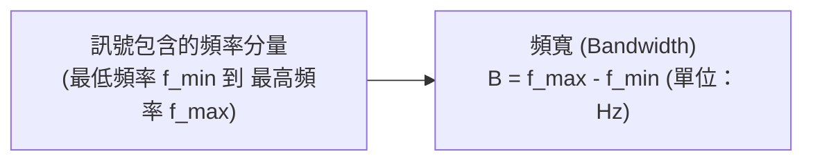
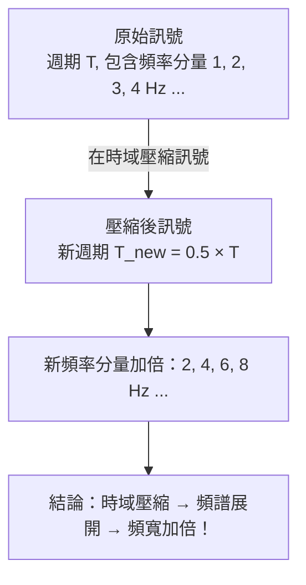
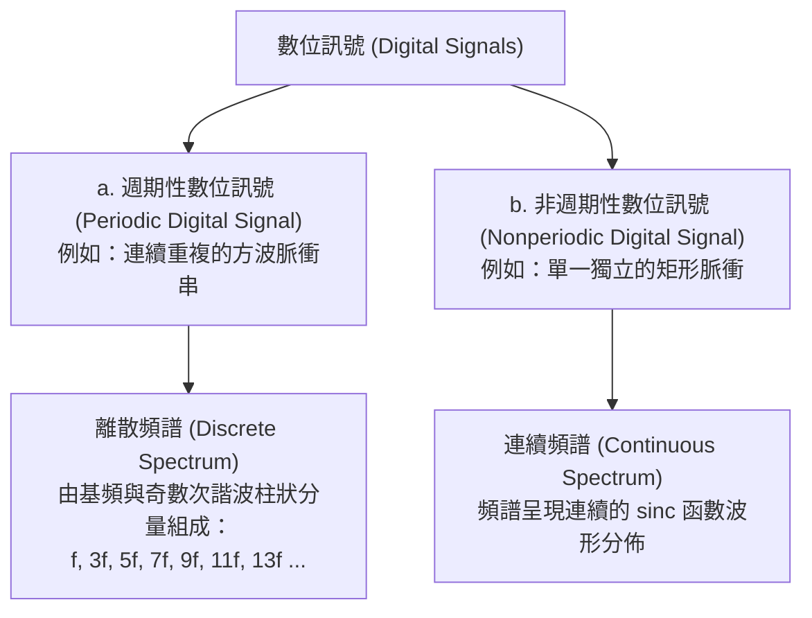
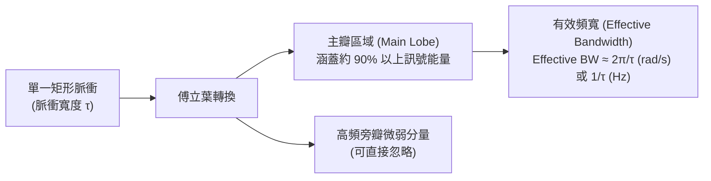
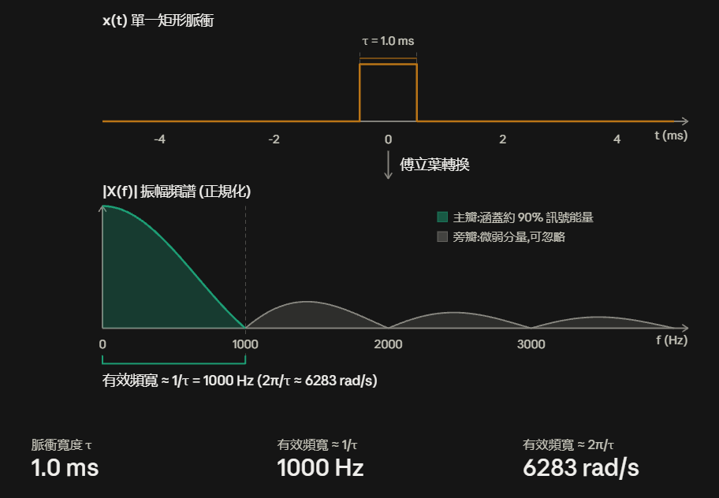

# 3. 頻寬、有效頻寬與傅立葉轉換性質 (Bandwidth & Fourier Properties)

在前面的章節中，我們掌握了正弦波的數學通式，並理解了週期性複合訊號可由多個正弦波疊加而成。

本節將深入簡報的核心主題：**什麼是訊號的頻寬？為什麼壓縮時間會擴展頻寬？傅立葉轉換具備哪五大關鍵性質？**

---

## 什麼是頻寬 (Bandwidth)？

在實體層與訊號處理中，頻寬有明確且嚴謹的物理定義：

> **核心定義**：頻寬的標準單位是 **赫茲 (Hertz, $\text{Hz}$)**，而非每秒位元數 ($\text{bps}$)。  
> **頻寬是由「訊號本身所包含的頻率分量範圍」決定的，而非由傳輸介質決定**（Bandwidth is determined by the signal, not the medium）。

### 範例：
- 若一個訊號由 $y = 0.5 \cos(2\pi \cdot 2 x) + 3 \cos(2\pi \cdot 5 x)$ 組成：
  - 包含的頻率分量為 $2\text{ Hz}$（振幅 0.5）與 $5\text{ Hz}$（振幅 3）。
  - 其頻寬即為 $5\text{ Hz} - 2\text{ Hz} = 3\text{ Hz}$（若計入直流成分 $0\text{ Hz}$，則為 $5\text{ Hz} - 0\text{ Hz} = 5\text{ Hz}$）。

---

## 時域壓縮與頻寬擴展 (Time Compression vs Bandwidth)

當我們在時域上「壓縮（Compress）」一個訊號時，頻寬會如何變化？

- **時域與頻域的互補關係**：
  - 新週期 $= \text{舊週期} \times 0.5$
  - 新頻率 $= \text{舊頻率} \times 2$
- **通訊意涵**：在時域中把脈衝壓得越窄（代表每秒能傳送更多位元，Bit Rate 提升），在頻域中佔用的頻寬就越大。

---

## 週期性 vs 非週期性數位訊號的傅立葉轉換

數位訊號在頻域中的分佈特性取決於其是否具有週期性：

1. **週期性數位訊號**：經傅立葉級數展開後，僅在特定離散頻率點（$f, 3f, 5f, \dots$）出現諧波振幅。
2. **非週期性數位訊號（單一脈衝）**：經傅立葉轉換後，頻譜分佈是一條連續平滑的曲線（$\text{sinc}$ 函數）。

---

## 有效頻寬 (Effective Bandwidth)

對於單一矩形脈衝訊號，其理論頻譜延伸至無窮大。但在實務通訊中：

- **定義**：忽略能量極微弱的高頻旁瓣，僅保留集中了約 **$90\%$ 總能量** 的主瓣頻率區間，稱為「有效頻寬」。
- **反比規律**：
  $$\text{脈衝寬度 } \tau \downarrow \implies \text{有效頻寬 } \text{Effective BW} \uparrow$$
  脈衝寬度越窄，有效頻寬越大。

- 

---

## 傅立葉轉換的五大關鍵物理性質 (Simple Properties of Fourier Transform)

簡報總結了通訊系統設計最重要的五大傅立葉轉換性質：

### 1. 矩形函數的傅立葉轉換 (Rectangular Function)
- 時域上的矩形函數 $x(t) = \text{rect}(t, \tau)$（寬度為 $\tau$），在頻域對應為 $\text{sinc}$ 函數。
- 頻譜第一個零點位置與脈衝寬度成反比，因此 **$\text{寬度 } \tau \downarrow \implies \text{有效頻寬 } \uparrow$**。

### 2. 時移性質 (Time Shift)
- **核心結論**：$s(t)$ 與平移後的 $s(t + \Delta)$ 擁有完全相同的頻譜振幅分佈（Same Spectrum）。
- **物理直覺**：在不同的時間點發送相同的訊號脈衝，其所佔用的頻譜成分與頻寬完全不變。

### 3. 時間縮放性質 (Time Scaling)
- **壓縮訊號 (Compress)** $\implies$ 位元時間縮短、位元傳輸率提高（Bit Rate $\uparrow$）$\implies$ **頻寬增加（Bandwidth $\uparrow$）**。
- **拉伸訊號 (Stretched)** $\implies$ 位元時間拉長、位元傳輸率降低（Bit Rate $\downarrow$）$\implies$ **頻寬減小（Bandwidth $\downarrow$）**。

### 4. 線性相加性質 (Sum of Time Domain Functions)
- 設複合訊號為兩個子訊號之和：$s(t) = s_1(t) + s_2(t)$。
- 只要 $s_1$ 與 $s_2$ 不發生破壞性完全抵消，$s(t)$ 的頻率分量就是 $s_1(t)$ 與 $s_2(t)$ 頻率分量的聯集。
- **連續傳送位元序列的頻寬結論**：
  - 假設 $s_1(t)$ 與 $s_2(t)$ 是在不同時間點連續送出的相同矩形脈衝。
  - 根據時移性質，兩者頻譜相同；根據相加性質，$s(t)$ 的頻寬就等於單一脈衝 $s_1(t)$ 的頻寬！
  - **傳送一長串連續位元流，其所需頻寬依然由單一個位元脈衝的寬度決定**。

### 5. 乘上餘弦函數性質 (Multiplied by a Cosine Function)
- 若基頻訊號 $s(t)$ 的頻率分量落在 $[0, f_s]$ 區間。
- 當 $s(t)$ 乘上載波 $\cos(2\pi f_c t)$ 後，其頻率分量將被整體搬移至 **$[f_c - f_s, \, f_c + f_s]$** 區間（通常載波頻率 $f_c \gg f_s$）。
- 這是**無線調變（Modulation）將低頻訊號搬移到高頻發射**的理論依據。

---

## 傅立葉五大性質對照總結表

| 性質編號 | 性質名稱 | 時域行為 $s(t)$ | 頻域頻譜行為 | 通訊工程意涵 |
|---|---|---|---|---|
| **1** | **矩形函數轉換** | 脈衝寬度 $\tau$ 縮減 | 主瓣寬度展寬 | 脈衝越窄，有效頻寬越大 |
| **2** | **時移性質 (Time Shift)** | $s(t + \Delta)$ 時間平移 | 頻譜振幅不變 | 不同時間送出相同波形，佔用頻率相同 |
| **3** | **時間縮放 (Time Scaling)** | 壓縮/拉伸時間 | 頻寬成反比擴展/收縮 | **傳輸速率提高 $\implies$ 頻寬需求成正比增加** |
| **4** | **線性相加 (Sum)** | $s_1(t) + s_2(t)$ 連續脈衝 | 頻譜為子訊號之聯集 | 連續位元串的頻寬由單一位元脈衝決定 |
| **5** | **乘上餘弦 (Multiply Cosine)** | $s(t) \cdot \cos(2\pi f_c t)$ | 頻譜平移至 $f_c \pm f_s$ | **無線調變將基頻搬移至高頻載波** |

---

## ❓ 初學者常見疑問與思維誤區 (Q&A)

??? question "Q1: 為什麼電信公司標榜的「頻寬」單位是 Hz，但我們買家用網路時「頻寬」單位卻是 Mbps？兩者有何差別？"
    **解答**：
    這是通訊領域最常見的名詞混淆：
    - **物理頻寬 (Bandwidth, 單位：$\text{Hz}$)**：指傳輸媒介或訊號所包含的「頻率範圍大小」（$B = f_{\max} - f_{\min}$），代表通道的「車道寬度」。
    - **資料傳輸速率 (Data Rate / Bit Rate, 單位：$\text{bps}$)**：指每秒實際傳送的「位元數量」，代表每秒運送的「貨物總量」。
    
    根據傅立葉時間縮放性質與有效頻寬公式：$\text{脈衝時間 } \tau \downarrow \implies \text{位元率 } (1/\tau) \uparrow \implies \text{所需頻寬 (Hz)} \uparrow$。
    物理頻寬（Hz）越大，才能容納越窄的脈衝，每秒能傳輸的位元速率（bps）才越高。

??? question "Q2: 為什麼傳送「連續 100 萬個位元」的長訊號，所需頻寬卻只由「單一個位元脈衝的寬度 $\tau$」決定？"
    **解答**：
    根據傅立葉轉換的**時移性質 (Time Shift)** 與 **線性相加性質 (Sum)**：
    1. 在不同時間送出的相同脈衝，其頻譜振幅分佈完全相同。
    2. 當多個脈衝連續在不同時間點送出時，整個複合訊號在頻域上的頻率分量就是單一脈衝頻率分量的聯集。
    
    因此，決定系統需要多少頻寬的關鍵是「每個位元脈衝被壓縮得有多窄（$\tau$ 有多小）」，而不是「總共傳了多少個位元」。

??? question "Q3: 矩形脈衝的頻譜明明延伸到無窮大，為什麼實務上只保留「主瓣（有效頻寬）」就能正確傳輸？"
    **解答**：
    因為矩形脈衝的絕大部分能量（約 $90\%$ 以上）都高度集中在中央主瓣區域（$[-1/\tau, 1/\tau]$ 或單側 $2\pi/\tau\text{ rad/s}$）。
    
    高頻旁瓣的作用僅僅是把方波的垂直轉角修得更方正。實務上只要通過有效頻寬，接收端在取樣判決時就足以正確辨識出高電位（1）與低電位（0），無需浪費無窮大的頻寬去傳送能量微弱的旁瓣。

---

## 下一步

現在我們知道數位脈衝的頻寬特性，也知道乘上餘弦波可以搬移頻譜。

那麼在無線通訊中，如何具體設定載波頻率與脈衝時間？接收端又如何還原資料？請前往下一節：[4. 數位調變、解調與適應性傳輸機制](modulation.md)。
