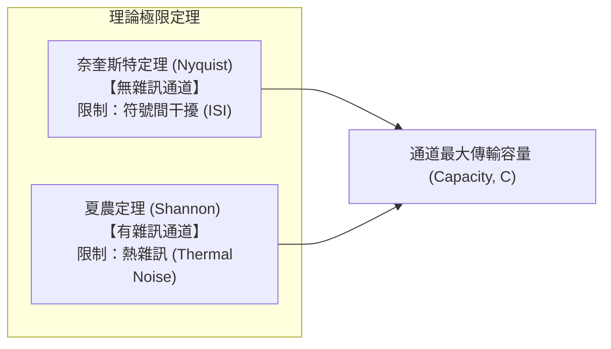

# 3. 頻寬、有效頻寬與傳輸極限 (Bandwidth & Channel Capacity)

在上一節中，我們發現了方波的本質：**瞬間跳變的直角邊緣，需要無窮多個高頻諧波疊加而成。**

然而在真實世界中，任何實體介質（銅線、光纖、空氣）都像是個「頻率過濾器（低通/帶通濾波器）」，無法讓所有頻率無損通過。本節將深入探討：**什麼是頻寬？需要多大的頻寬才能傳送資料？傳輸速率的物理極限又是什麼？**

---

## 什麼是頻寬 (Bandwidth)？

在實體層通訊中，「頻寬」有兩個截然不同但緊密相關的定義：

```
類比頻寬 (Spectral Bandwidth) ──[決定了]--> 數位頻寬 (Data Rate)
單位：赫茲 (Hz, MHz, GHz)                   單位：位元每秒 (bps, Mbps, Gbps)
```

1. **類比頻寬 / 頻譜頻寬 (Spectral Bandwidth, $B$)**：
   - 傳輸媒介或系統允許訊號有效通過的**最高頻率與最低頻率之差**。
   - 公式：$B = f_{high} - f_{low}$（單位：$\text{Hz}$）。
   - 例如：傳統電話線的通話頻段為 $300\text{ Hz} \sim 3300\text{ Hz}$，其類比頻寬為 $B = 3000\text{ Hz}$ ($3\text{ kHz}$)。
2. **數位頻寬 / 資料傳輸率 (Data Rate / Bit Rate, $R$)**：
   - 單位時間內通道能傳送的二進位位元數，單位為 **bps (bits per second)**。

---

## 絕對頻寬 vs 有效頻寬 (Effective Bandwidth)

```
振幅 (V)
 ^
 | 1.0 (基頻 f0)
 |  |
 |  |    0.33 (3次諧波)
 |  |     |     0.2 (5次諧波)   0.14 (7次諧波)  0.01 (99次諧波)
 +--+-----+------+---------------+---------------+-------------> 頻率 (Hz)
    [======= 有效頻寬 (包含 90%+ 能量) =======]
    [========================= 絕對頻寬 (∞) =========================]
```

### 1. 絕對頻寬 (Absolute Bandwidth)
- 訊號頻譜中**所有非零頻率成分**的總跨度。
- 對於理想方波而言，因為諧波延伸到無窮大 ($n \to \infty$)，所以方波的絕對頻寬是**無限大 ($\infty$)**。

### 2. 有效頻寬 (Effective Bandwidth)
- 真實電線根本不可能提供無限頻寬。幸運的是，傅立葉展開告訴我們：**諧波次數越高，振幅衰減越快 ($1/n$)**。
- 前幾次諧波（如基頻 + 3 次 + 5 次諧波）就已經集中了方波訊號 **$90\% \sim 95\%$ 以上的總能量**。
- **定義**：只要保留能夠讓接收端**清晰分辨出高低電位（0 與 1）**所需的最低頻率範圍，就稱為「有效頻寬」。

#### 傳輸方波需要多少有效頻寬？
假設以 $R\text{ bps}$ 的速率傳送二進位方波，最極端、變化最快的位元序列是 `1 0 1 0 1 0 ...`：
- 此時方波每 2 個位元完成一次完整震盪週期（1 個週期包含 1 個高電位與 1 個低電位），因此**基頻為 $f_0 = \frac{R}{2}\text{ Hz}$**。

| 保留的頻率成分 | 需要的通道頻寬 $B$ | 接收端看到的波形 | 判決效果 |
|---|---|---|---|
| **僅基頻 ($f_0$)** | $B = \frac{R}{2}\text{ Hz}$ | 純正弦波 | 勉強可分辨 0/1，但邊緣平緩，易受雜訊誤判 |
| **基頻 + 3 次諧波 ($f_0, 3f_0$)** | $B = \frac{3R}{2}\text{ Hz}$ | 帶有平頂的類方波 | 可良好辨識 0/1（實務常用） |
| **基頻 + 3次 + 5次諧波** | $B = \frac{5R}{2}\text{ Hz}$ | 相當方正的波形 | 非常精確，抗雜訊能力佳 |

> **結論**：若要在媒介中以 $R\text{ bps}$ 傳送數位方波，通道至少需要 $B \ge \frac{R}{2}\text{ Hz}$ 的頻寬；若要獲得較佳品質，通常需要 $B \approx \frac{3R}{2} \sim \frac{5R}{2}\text{ Hz}$。

---

## 關鍵參數：鮑率 (Baud Rate) vs 位元率 (Bit Rate)

初學者極易混淆 Baud 與 Bit 的概念：

- **位元率 (Bit Rate, $R$)**：每秒傳送的 **「0 或 1」的個數**（單位：$\text{bps}$）。
- **鮑率 / 符號率 (Baud Rate / Symbol Rate, $S$)**：每秒內**訊號狀態改變的次數**（單位：$\text{Baud}$ 或 $\text{symbols/s}$）。

兩者的換算公式為：

$$R = S \times \log_2(L)$$

其中 $L$ 代表**每個訊號符號（Symbol）所能呈現的不同狀態數（階數，Signal Levels）**。

```
【比喻：高速公路運貨】
- 鮑率 (Baud Rate)：每秒開過去的「卡車數量」。
- 訊號狀態數 (L)：每輛卡車能裝幾箱貨物 (1 輛車裝 2^n 箱 = n bits)。
- 位元率 (Bit Rate)：每秒實際運送的「貨物總箱數」。

• 若 L = 2 (只有高/低 2 種電壓)：1 輛卡車載 1 bit  ⟹ Bit Rate = Baud Rate × 1
• 若 L = 4 (有 4 種電壓準位)：  1 輛卡車載 2 bits ⟹ Bit Rate = Baud Rate × 2
• 若 L = 256 (256-QAM 調變)：   1 輛卡車載 8 bits ⟹ Bit Rate = Baud Rate × 8
```

---

## 通道傳輸極限定理

網路傳輸速率不是想提多高就能提多高。通訊歷史上有兩座無法逾越的數學豐碑：



### 1. 奈奎斯特定理 (Nyquist Bit Rate) —— 無雜訊通道的極限
1928 年，哈利·奈奎斯特（Harry Nyquist）證明：對於一個類比頻寬為 $B\text{ Hz}$ 的**無雜訊（Noiseless）理想通道**，為了避免相鄰符號互相重疊干擾（**碼間干擾, ISI**），最高符號率不能超過 $2B\text{ Baud}$。

最大理論資料率 $C_{\text{Nyquist}}$ 為：

$$C = 2B \log_2(L) \quad (\text{bps})$$

- **意涵**：在無雜訊環境下，如果想在有限頻寬 $B$ 內提升速率，唯一的方法就是**增加訊號階數 $L$**（讓每個波形代表更多 bits）。

---

### 2. 夏農定理 (Shannon Channel Capacity) —— 有雜訊真實通道的極限
1948 年，資訊理論之父克勞德·夏農（Claude Shannon）進一步考慮了物理世界中無法避免的**隨機熱雜訊（Thermal Noise / Gaussian Noise）**。

在頻寬為 $B\text{ Hz}$、存在雜訊的通道中，理論極限容量 $C_{\text{Shannon}}$ 為：

$$C = B \log_2(1 + \text{SNR}) \quad (\text{bps})$$

#### 訊噪比 (Signal-to-Noise Ratio, $\text{SNR}$)
- **定義**：訊號功率與雜訊功率的比值，$\text{SNR} = \frac{P_{\text{signal}}}{P_{\text{noise}}}$。
- **分貝轉換 ($\text{dB}$)**：
  $$\text{SNR}_{\text{dB}} = 10 \log_{10}(\text{SNR}) \iff \text{SNR} = 10^{\frac{\text{SNR}_{\text{dB}}}{10}}$$

> **夏農定理的重大啟示**：
> 1. 無論你設計多精巧的編碼或調變技術，**傳輸速率絕對不可能超過夏農極限**。
> 2. 通道容量僅由兩個客觀物理量決定：**通道頻寬 $B$** 與 **訊噪比 $\text{SNR}$**。
> 3. 雜訊為訊號階數 $L$ 劃下了上限——階數切得太細，相鄰階層的電壓差小於雜訊振幅時，接收端就會誤判。

---

## 經典範例演練：Nyquist 與 Shannon 的交會

!!! example "經典考試與實務計算題"
    **題目**：某傳統電話線頻寬 $B = 3000\text{ Hz}$，測得訊噪比為 $30\text{ dB}$。
    
    1. 根據夏農定理，該線路的最大理論容量 $C$ 是多少？
    2. 若希望達到此極限容量，根據奈奎斯特定理，訊號至少需要設計成多少個階數 ($L$)？

    ??? success "詳細計算過程與解答"
        **第一步：計算夏農極限容量**
        - 將 $\text{SNR}_{\text{dB}} = 30\text{ dB}$ 轉為真實比值：
          $$\text{SNR} = 10^{30/10} = 10^3 = 1000$$
        - 代入夏農公式：
          $$C = 3000 \times \log_2(1 + 1000) \approx 3000 \times \log_2(1001)$$
        - 因 $2^9 = 512, 2^{10} = 1024$，$\log_2(1001) \approx 9.967$：
          $$C \approx 3000 \times 9.967 \approx 29,901\text{ bps} \approx 30\text{ kbps}$$
        *(這正是早期 33.6k / 56k 電話數據機 Modem 速度上限的物理由來！)*

        **第二步：求所需訊號階數 $L$**
        - 根據奈奎斯特定理：
          $$C = 2B \log_2(L) \implies 30000 = 2 \times 3000 \times \log_2(L)$$
          $$\log_2(L) = \frac{30000}{6000} = 5 \implies L = 2^5 = 32$$
        - **結論**：訊號必須具備至少 $32$ 個不同狀態（如 32 個不同電壓或相位，每個 Symbol 攜帶 5 個 bits），才能在 3 kHz 頻寬下達到 30 kbps 的傳輸速率。

---

## ❓ 初學者常見疑問與思維誤區 (Q&A)

??? question "Q1: 家裡中華電信光世代說的「500M 頻寬」，跟電磁學的「20 MHz 頻寬」是一樣的東西嗎？"
    **解答**：
    **名字相同，但物理意義與單位完全不同！**
    - **電磁學 / 實體層的頻寬**：指的是**頻譜寬度 (Spectral Bandwidth)**，單位是 **$\text{Hz}$**（例如 Wi-Fi 頻道寬度為 20 MHz 或 80 MHz）。它代表傳輸介質在頻率軸上能容納的訊號跨度。
    - **電信業者 / 網路日常說的頻寬**：指的是**最大資料傳輸率 (Data Rate / Bit Rate)**，單位是 **$\text{bps}$ (如 500 Mbps)**。它代表每秒能傳送多少個位元。
    
    兩者的關係是：**實體層的頻譜頻寬（Hz）越大，透過夏農與奈奎斯特轉換後能達成的資料傳輸率（bps）就越高**。

??? question "Q2: 既然奈奎斯特定理說只要 $L \to \infty$（如切分成 100 萬個電壓階層），資料率就能無限大，為什麼我們不做？"
    **解答**：
    因為**真實世界存在雜訊（Noise）**。
    
    假設傳輸電壓範圍是 $0\text{V} \sim 1\text{V}$：
    - 若 $L = 2$，兩個狀態分別是 $0\text{V}$ 與 $1\text{V}$，容許雜訊達到 $0.4\text{V}$ 都不會判錯。
    - 若 $L = 1000$，相鄰兩個階層的差距只有 $1\text{mV}$ ($0.001\text{V}$)。環境中微弱的電磁干擾或線路發熱雜訊（通常有幾毫伏）就會輕易把 `0000000001` 震盪變成 `0000000010`，導致整串資料全錯。
    
    這正是為什麼**夏農定理是硬極限**——雜訊決定了訊號階數 $L$ 的天花板。

??? question "Q3: 什麼是碼間干擾 (Inter-Symbol Interference, ISI)？"
    **解答**：
    當你把連續的方波脈衝送進有限頻寬的電線時，高頻被濾除會導致原本方正的脈衝「邊緣塌陷且往兩側擴散（波形拖尾）」。
    
    如果傳送速度太快（超過奈奎斯特極限 $2B\text{ Baud}$），前一個脈衝還沒衰減完畢，後一個脈衝就到了，前後兩個訊號波形在接收端疊在一起，就像墨水在宣紙上暈開一樣，接收端將再也無法分辨前後兩個位元，這就稱為 **ISI**。

---

## 下一步

到目前為止，我們理解了有線媒介中方波的極限。然而在有線網路中，如何把位元變成合適的電壓波形（基頻編碼）？

請前往下一節：[4. 基頻編碼與傳輸模式](signal-encoding.md)。
