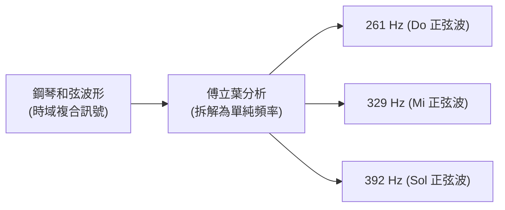
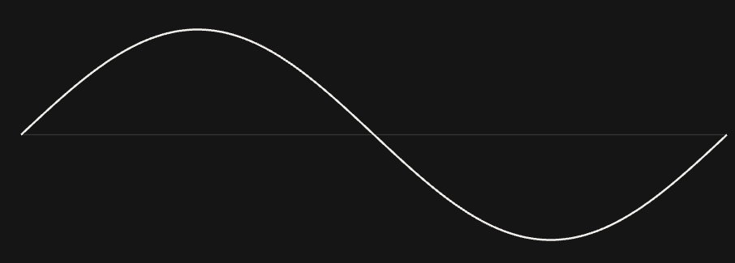
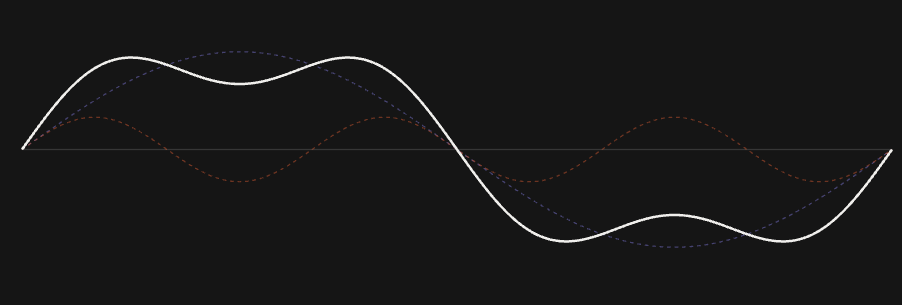
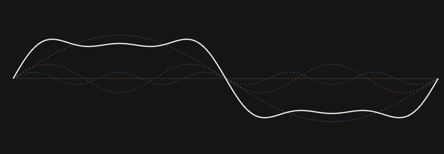

# 2. 方波構成與傅立葉分析 (Square Wave & Fourier Analysis)

> **核心觀念**：傅立葉分析（Fourier Analysis）的本質，就是**將任何看似複雜、扭曲的訊號，拆解成 $n$ 個頻率不同、振幅不同的純淨正弦波（$\sin$）與餘弦波（$\cos$）之和**。

---

## 直觀理解：音樂與和弦的聯想

在進入數學前，我們先用一個音樂的例子來建立直覺：

當鋼琴同時按下 **Do - Mi - Sol** 時，空氣中傳播的是一個由三個音疊加在一起的「複合聲波」（時域波形看起很複雜）。然而，人的耳朵與音樂家卻能輕易聽出：
- 這個聲音由 **261 Hz (Do)**、**329 Hz (Mi)** 與 **392 Hz (Sol)** 三個純音組成。
- 其中哪一個音比較大聲（振幅較大）、哪一個比較小聲（振幅較小）。



**傅立葉分析在通訊中的角色正是如此**：它就像一位調音師，能將傳輸線中任何複雜的電壓波形，精確拆解為「由哪些頻率的 $\sin$ 與 $\cos$ 組成、各自佔多大比例」。

---

## 數學通式：訊號的組成結構

任何週期為 $T$ 的連續訊號 $g(t)$，都可以精確寫成一串正弦波與餘弦波的相加（稱為**傅立葉級數 Fourier Series**）：

$$g(t) = c + \sum_{n=1}^{\infty} \left( a_n \cos(2\pi n f_0 t) + b_n \sin(2\pi n f_0 t) \right)$$

展開來看：

$$g(t) = \underbrace{c}_{\text{直流分量 (平均電壓)}} + \underbrace{(a_1 \cos \omega t + b_1 \sin \omega t)}_{\text{基頻成分 (頻率 } f_0 \text{)}} + \underbrace{(a_2 \cos 2\omega t + b_2 \sin 2\omega t)}_{\text{2 次諧波 (頻率 } 2f_0 \text{)}} + \dots + \underbrace{(a_n \cos n\omega t + b_n \sin n\omega t)}_{\text{n 次諧波 (頻率 } n f_0 \text{)}}$$

### 參數解讀：
- **基頻 (Fundamental Frequency, $f_0 = 1/T$)**：決定波形重複週期的基本頻率。
- **諧波 (Harmonics, $n \cdot f_0$)**：頻率為基頻整數倍的成分（$2f_0, 3f_0, \dots$）。
- **係數 $a_n, b_n$**：代表該頻率成分在訊號中所佔的**振幅大小（強度）**。如果某個頻率的係數為 0，代表訊號中完全沒有該頻率。
- **$\cos$ 與 $\sin$ 的搭配**：$\sin$ 負責奇對稱波形，$\cos$ 負責偶對稱波形，兩者疊加就能組合成任意相位的波形。

---

## 電腦的 0 與 1：方波是如何構成的？

在數位通訊中，傳遞 0 與 1 最常見的波形是具有直角跳變的「方波 (Square Wave)」：

```
電壓 (V)
 ^
 |    +-------+       +-------+
 |    |   1   |   0   |   1   |   0
 0----+       +-------+       +-------+-----> 時間 (t)
```

對一個週期為 $T$（基頻 $f_0 = 1/T$）、振幅在 $+A$ 與 $-A$ 之間跳變的標準方波進行傅立葉展開，其公式為：

$$s(t) = \frac{4A}{\pi} \sum_{n=1, 3, 5, \dots}^{\infty} \frac{1}{n} \sin(2\pi n f_0 t)$$

將各項展開：

$$s(t) = \frac{4A}{\pi} \left[ \underbrace{\sin(2\pi f_0 t)}_{\text{基頻 (振幅 1)}} + \underbrace{\frac{1}{3}\sin(6\pi f_0 t)}_{\text{3 次諧波 (振幅 1/3)}} + \underbrace{\frac{1}{5}\sin(10\pi f_0 t)}_{\text{5 次諧波 (振幅 1/5)}} + \underbrace{\frac{1}{7}\sin(14\pi f_0 t)}_{\text{7 次諧波 (振幅 1/7)}} + \dots \right]$$

### 方波的兩大特性：
1. **僅包含奇數次諧波**：只由基頻 $f_0$ 以及 $3f_0, 5f_0, 7f_0 \dots$ 組成，沒有偶數次諧波。
2. **諧波振幅與次數成反比 ($1/n$)**：頻率越高，振幅越小（$1, \frac{1}{3}, \frac{1}{5}, \frac{1}{7} \dots$）。

---

## 視覺化：諧波如何一步步疊加出方波？

### 第 1 步：僅基頻 ($n=1$)
- **合成式**：$\sin(2\pi f_0 t)$
- **波形特徵**：純粹平滑的正弦波，頂部圓潤、邊緣平緩。



---

### 第 2 步：加入 3 次諧波 ($n=1, 3$)
- **合成式**：$\sin(2\pi f_0 t) + \frac{1}{3}\sin(6\pi f_0 t)$
- **波形特徵**：3 次諧波在波峰處反向抵消使頂部變平，兩側同向相加使邊緣開始變陡！



---

### 第 3 步：加入 5 次諧波 ($n=1, 3, 5$)
- **合成式**：$\dots + \frac{1}{5}\sin(10\pi f_0 t)$
- **波形特徵**：頂部更加平整，上升與下降邊緣已非常接近垂直！



---

### 極限狀態：加入無限項奇數諧波 ($n \to \infty$)
- **波形**：邊緣完全垂直 90 度，頂部完全水平 ── **【理想數位方波】**！


---

## 時域圖 vs 頻域圖：兩種分析視角

通訊工程中使用兩種座標圖來觀察訊號：

```
【時域圖 (Time Domain)】                【頻域圖 / 頻譜 (Frequency Domain)】
示波器看：電壓隨時間的「波形」          頻譜儀看：組成訊號的「頻率分量與振幅」

電壓 (V)                               振幅 (A)
 ^                                      ^
 |    +----+     +----+                 | 1.0 (基頻)
 |    |    |     |    |                 |  |
 |    |    |     |    |                 |  |    0.33 (3次諧波)
 0----+    +-----+    +---> 時間 (t)    |  |     |   0.2 (5次) 0.14 (7次)
                                        +--+-----+----+----+-----> 頻率 (Hz)
                                          f0    3f0  5f0  7f0
```

- **時域圖 (Time Domain)**：橫軸是**時間 ($t$)**，縱軸是瞬時電壓。表示訊號在某一時間點的實際強度。
- **頻域圖 / 頻譜 (Frequency Domain Spectrum)**：橫軸是**頻率 ($f$)**，縱軸是各頻率成分的**振幅大小**。表示訊號是由哪些頻率成分以何種比例疊加而成。

---

## 頻率與振幅的本質關係：為什麼邊緣越陡，高頻越多？

這是實體層通訊最重要的物理定律：

$$\text{時域上的急遽跳變（上升時間 } t_r \to 0 \text{）} \iff \text{頻域上需要極高頻率的諧波成分}$$

- **低頻成分**（如基頻 $f_0$）：決定訊號的**主體輪廓與主要能量**（佔總能量 90% 以上）。
- **高頻成分**（如 $3f_0, 5f_0, 7f_0 \dots$）：決定訊號**直角邊緣的陡峭程度與跳變精確度**。
- **失真 (Distortion)**：如果實體線路無法通過高頻成分（高頻衰減），接收端收到的方波邊緣就會塌陷、變圓，若失真過大會導致接收端無法正確判讀 0 與 1。

---

## ❓ 初學者常見疑問與思維誤區 (Q&A)

??? question "Q1: 為什麼一定要用 $\sin$ 與 $\cos$ 當作分解基礎？"
    **解答**：
    因為正弦訊號是線性傳輸系統的**特性響應訊號**：
    - 當一個純正弦波通過電纜、濾波器或空氣時，輸出的訊號**永遠維持原本的正弦波形**，只會發生振幅衰減或時間延遲。
    - 如果用其他波形（如三角波）當基礎，訊號通過線路後形狀會完全失真，無法進行分析。

??? question "Q2: 傅立葉級數 (Fourier Series) 與 傅立葉轉換 (Fourier Transform) 的差別是什麼？"
    **解答**：
    - **傅立葉級數 (Fourier Series)**：用於分析**週期性訊號**（如不斷重複的 `101010` 測試波形），其頻譜是由一根根離散的頻率柱狀線（$f_0, 3f_0, 5f_0$）組成。
    - **傅立葉轉換 (Fourier Transform)**：用於分析**非週期性訊號**（如真實傳輸中隨機排列的位元流），其頻譜是一條連續的頻率曲線。

---

## 下一步

現在我們知道數位方波需要多個高頻諧波才能完整傳送。那麼，真實的電線到底能讓多大範圍的頻率通過？傳輸速率的極限在哪裡？

請前往下一節：[3. 頻寬、有效頻寬與傳輸極限](bandwidth-and-capacity.md)。
