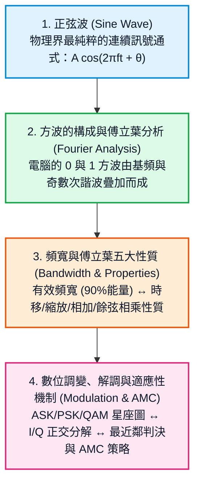
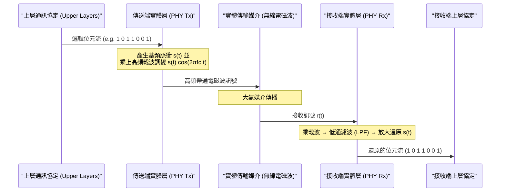

# 實體層 Physical Layer 全景導覽

實體層（Physical Layer）是 OSI 七層模型的最底層（Layer 1）。它的核心任務只有一個：**將上層的邏輯資料（0 與 1 位元串），轉換為可在真實物理媒介（空氣電磁波、電纜）中傳遞的實體訊號（高頻載波電壓、電磁波），並在接收端還原。**

---

## 為什麼需要從「正弦波」開始學網路？

很多初學者在剛翻開網路通訊教科書時常感到困惑：

> *「我明明是來學電腦網路和軟體協定的，為什麼第一堂課老師在黑板上畫三角函數、正弦波、頻率和傅立葉轉換？」*

要理解網路通訊的底層邏輯，必須掌握課堂簡報中**環環相扣的四大推導脈絡**：

---

## 本章循序漸進閱讀指南

本章節完全依照課堂簡報之推導進程，由淺入深拆解實體層技術：

| 章節 | 核心課題 | 一句話總結 |
|---|---|---|
| [1. 正弦波特性與通式](sine-wave.md) | 什麼是正弦波？三個基本參數是什麼？ | 任何週期訊號的基礎「積木」，用振幅、頻率與相位數學精確描述波形。 |
| [2. 方波構成與傅立葉分析](fourier-and-square-wave.md) | 數位方波是怎麼生出來的？ | 透過傅立葉級數，方波其實是「基頻 + 奇數次諧波」的疊加。 |
| [3. 頻寬與傅立葉轉換性質](bandwidth-and-capacity.md) | 什麼是頻寬？壓縮時間為何會展寬頻率？ | 頻寬以 Hz 為單位，矩形脈衝主瓣集中 90% 能量，掌握傅立葉五大物理性質。 |
| [4. 數位調變、解調與適應性傳輸機制](modulation.md) | 如何利用正弦波傳送 0/1 並在雜訊中精準還原？ | ASK/PSK/QAM 星座圖映射、I/Q 正交雙載波解調，以及依 SNR 動態調整的 AMC 策略。 |

---

## 實體層在通訊系統中的位置

準備好探索實體層的底層奧秘了嗎？請點擊進入第一節：[1. 正弦波特性與通式](sine-wave.md)。
