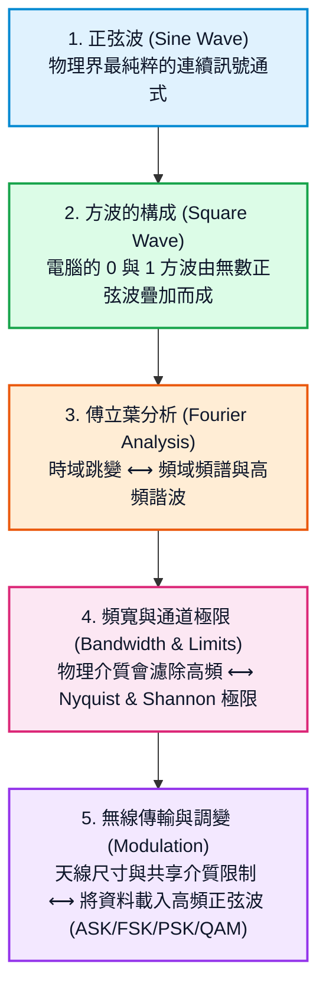
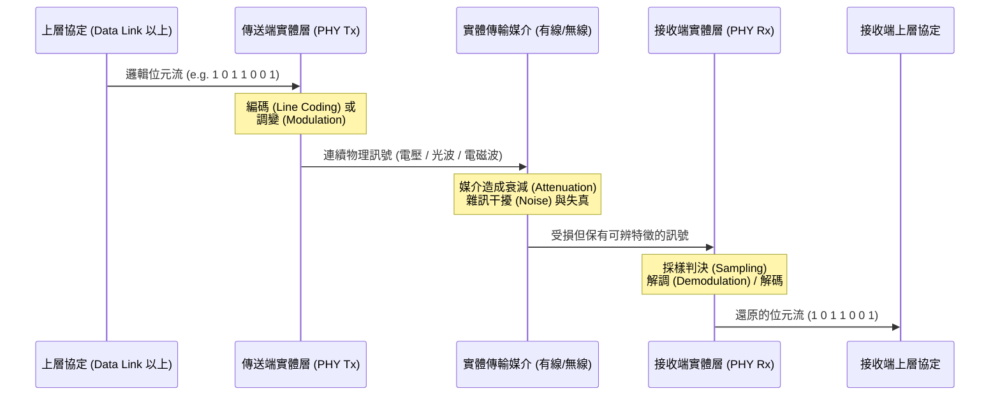

# 實體層 Physical Layer 全景導覽

實體層（Physical Layer）是 OSI 七層模型的最底層（Layer 1）。它的核心任務只有一個：**將上層的邏輯資料（0 與 1 位元串），轉換為可在真實物理媒介（銅線、光纖、空氣電磁波）中傳遞的實體訊號（電壓、光脈衝、無線電波），並在接收端還原。**

---

## 為什麼需要從「正弦波」開始學網路？

很多初學者在剛翻開網路通訊教科書時常感到困惑：

> *「我明明是來學電腦網路和軟體協定的，為什麼第一堂課老師在黑板上畫三角函數、正弦波、頻率和傅立葉轉換？」*

這個疑惑非常正常。要理解網路通訊的底層邏輯，必須掌握以下**環環相扣的知識脈絡**：

---

## 本章循序漸進閱讀指南

本章節按照通訊原理的演進邏輯，由淺入深拆解實體層技術：

| 章節 | 核心課題 | 一句話總結 |
|---|---|---|
| [1. 正弦波特性與通式](sine-wave.md) | 什麼是正弦波？三個基本參數是什麼？ | 任何週期訊號的基礎「積木」，用數學精確描述波形。 |
| [2. 方波構成與傅立葉分析](fourier-and-square-wave.md) | 數位方波是怎麼生出來的？ | 透過傅立葉級數，方波其實是「基頻 + 奇數次諧波」的疊加。 |
| [3. 頻寬與傳輸極限](bandwidth-and-capacity.md) | 為什麼網路線不能跑無限快？ | 媒介具有頻寬限制，Nyquist 與 Shannon 定理劃定了速度天花板。 |
| [4. 基頻編碼與傳輸模式](signal-encoding.md) | 有線網路如何用電壓傳 0/1？ | NRZ、曼徹斯特編碼解決時脈同步與直流漂移問題。 |
| [5. 無線傳輸與調變技術](modulation.md) | 無線訊號如何把 0/1 射向空中？ | 透過 ASK、FSK、PSK 與高階 QAM 把資料載入高頻載波。 |
| [6. 傳輸媒介與標準規格](media.md) | 雙絞線、光纖、天線的物理差異 | 導向式與非導向式媒介特性及常見乙太網標準（Cat6、光纖）。 |

---

## 實體層在通訊系統中的位置

準備好探索實體層的底層奧秘了嗎？請點擊進入第一節：[1. 正弦波特性與通式](sine-wave.md)。
