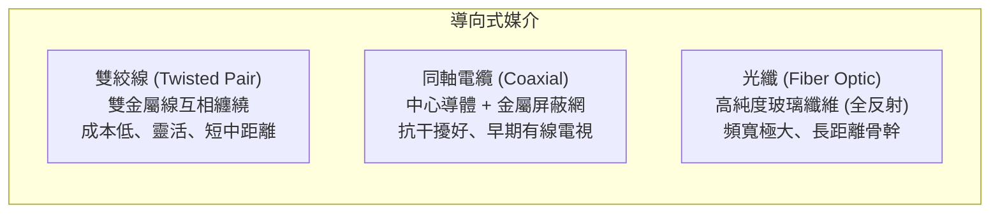

# 6. 傳輸媒介與實體層標準 (Transmission Media & Standards)

實體訊號最終必須藉由某種物理通道進行傳播。傳輸媒介主要分為兩大類：**導向式媒介 (Guided Media)** 與 **非導向式媒介 (Unguided Media)**。

---

## 導向式媒介 (有線傳輸)

訊號被約束在封閉的實體導體或導波管中前進。



### 1. 雙絞線 (Twisted Pair Cable)
- **結構**：由兩條互相絕緣的銅導線，按照特定密度**相互絞合（Twist）**在一起。
- **為什麼要絞合？**
  - 當外部電磁干擾（EMI）射入時，兩條導線因不斷交叉而感應到大小相等、極性相同的干擾電壓。
  - 接收端採用**差動訊號 (Differential Signaling)**，只讀取兩線的電壓差 $(V_+ - V_-)$，干擾訊號被完美相減抵消！
- **分類**：
  - **UTP (Unshielded Twisted Pair, 非遮蔽雙絞線)**：最常見、柔軟且便宜（一般家用網路線）。
  - **STP (Shielded Twisted Pair, 遮蔽雙絞線)**：外層包裹金屬鋁箔或編織網，適用於高干擾工業環境。

### 常見乙太網路雙絞線等級 (Categories)：

| 規格等級 | 最高頻寬 (Hz) | 最大傳輸速率 | 常用傳輸距離 | 適用場景 |
|---|---|---|---|---|
| **Cat5e** | 100 MHz | 1 Gbps (1000BASE-T) | 100 公尺 | 家用一般上網、辦公室 |
| **Cat6** | 250 MHz | 1 Gbps (100m) / 10 Gbps (55m) | 100 / 55 公尺 | 現代住宅與企業主流佈線 |
| **Cat6a** | 500 MHz | 10 Gbps (10GBASE-T) | 100 公尺 | 資料中心、高速伺服器機房 |
| **Cat7 / Cat8** | 600 ~ 2000 MHz | 25G / 40 Gbps | 30 公尺 | 機櫃間高速互連 |

---

### 2. 同軸電纜 (Coaxial Cable)
- **結構**：核心為單根銅導體，外層依序為絕緣層、金屬編織屏蔽網（接地防止干擾）與塑料外皮。
- **特性**：屏蔽效果與頻寬優於雙絞線，但線徑粗、質地硬、施工不易。
- **應用**：傳統有線電視 (CATV)、第四台 Cable Modem、早期的 10BASE2/10BASE5 乙太網路。

---

### 3. 光纖 (Fiber Optic Cable)
- **原理**：利用光在纖芯（Core）與包層（Cladding）介面上的**全內反射 (Total Internal Reflection)** 現象傳遞光脈衝。
- **超群優點**：
  1. **頻寬極高**：單芯可輕鬆承載數十 Tbps 資料。
  2. **衰減極低**：傳輸數十公里無需中繼放大。
  3. **完全免疫電磁干擾**：光訊號不受雷擊、高壓電線或無線電干擾。
  4. **安全性高**：極難被非接觸式竊聽。

```
單模光纖 (Single-Mode Fiber, SMF)          多模光纖 (Multi-Mode Fiber, MMF)
纖芯直徑極細 (約 8~10 μm)                  纖芯直徑較粗 (約 50~62.5 μm)
-----------------------------              -----------------------------
  =======================                    \  /  \  /  \  /  \  /
  ---- 單一光線筆直前進 ----                   \/    \/    \/    \/ (多路徑全反射)
  =======================                    /\    /\    /\    /\
-----------------------------              -----------------------------
• 光源：雷射 (Laser)                      • 光源：LED 或 VCSEL (成本低)
• 特點：無模態色散，距離達數十公里       • 特點：有模態色散，適合幾百米短距
• 應用：跨海電纜、電信骨幹網路           • 應用：資料中心內部機櫃互聯、校園骨幹
```

---

## 非導向式媒介 (無線電磁波頻譜)

電磁波在空中傳播，依頻率特性具有不同的傳播行為：

```
3 kHz           300 MHz          3 GHz           30 GHz          300 GHz     400 THz
  |----- 無線電波 (Radio) -----|--- 微波 (Microwave) ---|-- 毫米波 (mmWave) --|-- 紅外線 / 可見光 --|
  • 穿透力強、繞射佳           • 視距傳播 (LOS)         • 頻寬極大、易被雨水/ • 直線傳播、無法穿牆
  • 廣播、調幅 AM/FM           • Wi-Fi (2.4G/5G)、4G/5G   人體阻擋 (5G 毫米波) • 遙控器、光通訊 Li-Fi
```

- **低頻電磁波（< 1 GHz）**：波長長，具有良好的繞射（Diffraction）能力，能穿透牆壁與障礙物（如 4G 700MHz/900MHz「黃金頻段」）。
- **高頻電磁波（> 5 GHz ~ 毫米波）**：波長短，近似光線的**直線傳播（Line-of-Sight, LOS）**，穿透力差，但擁有**極為龐大的頻譜頻寬**，是 5G 超高速與 Wi-Fi 6E/7 的核心戰場。

---

## 媒介效能全面比較表

| 媒介類型 | 傳輸速率潛力 | 典型最大距離 | 抗電磁干擾 (EMI) | 佈線成本與施工難度 |
|---|---|---|---|---|
| **雙絞線 (UTP/STP)** | 10 Mbps ~ 10 Gbps | 100 公尺 | 中等（易受強電磁場干擾） | 便宜、非常容易施工 |
| **同軸電纜** | 10 Mbps ~ 1 Gbps | 200 ~ 500 公尺 | 佳 | 中等、線身較重較硬 |
| **多模光纖 (MMF)** | 10 Gbps ~ 100 Gbps | 300 ~ 500 公尺 | **極佳（完全免疫）** | 偏高（光收發模組成本高） |
| **單模光纖 (SMF)** | 100 Gbps ~ 數 Tbps | 10 ~ 80 公里（無中繼） | **極佳（完全免疫）** | 高（熔接技術要求高） |
| **無線電波 / Wi-Fi**| 100 Mbps ~ 10 Gbps | 10 ~ 50 公尺（室內） | 差（易受同頻干擾/遮擋） | 無需實體佈線、隨處移動 |

---

## ❓ 初學者常見疑問與思維誤區 (Q&A)

??? question "Q1: 光纖裡面跑的是光，那光纖傳輸的速度真的是「真空中光速 ($3 \times 10^8\text{ m/s}$)」嗎？"
    **解答**：
    **不是！**
    
    光的傳播速度取決於介質的折射率 $n$（公式為 $v = c / n$）。
    - 光纖所用的高純度二氧化矽玻璃，其折射率約為 $n \approx 1.45 \sim 1.5$。
    - 因此，光在玻璃光纖中的傳播速度約為：
      $$v = \frac{3 \times 10^8}{1.47} \approx 2.04 \times 10^8\text{ m/s}$$
    也就是大約只有真空光速的 **$2/3$（約每毫秒 200 公里）**。巧合的是，電訊號在銅線中的傳播速度（電子波信號傳播速度）也大約是 $2 \times 10^8\text{ m/s}$。光纖的優勢在於**頻寬極大與超低衰減**，而不是單個光子跑得比銅線裡的電磁波快多少！

??? question "Q2: 為什麼標準乙太網路雙絞線（Cat5e/Cat6）的長度上限都是 100 公尺？超過會怎樣？"
    **解答**：
    100 公尺的限制來自兩個因素的平衡：
    1. **訊號衰減 (Attenuation)**：高頻電訊號在細銅線中經過 100 公尺後，能量衰減嚴重，接收端難以在雜訊中辨識電位。
    2. **CSMA/CD 碰撞偵測時間**：在早期共享乙太網中，為了保證最遠端的兩台電腦能在送完最小封包（64 Bytes）前偵測到訊號碰撞，限定了傳播往返延遲（Round-Trip Time, RTT）。
    
    如果超過 100 公尺，網路可能會頻繁掉速（自適應從 1 Gbps 降到 100M/10M）甚至完全無法連線。

---

## 實體層總結

至此，我們已經完整學習了實體層的所有精髓：
從 **正弦波數學通式** $\to$ **方波傅立葉拆解** $\to$ **頻寬與夏農極限** $\to$ **基頻編碼** $\to$ **無線調變技術** $\to$ **物理媒介特性**！

恭喜你掌握了實體層的所有底層通訊原理！
