# 4. 數位調變、解調與適應性傳輸機制 (Modulation, Demodulation & AMC)

在前面章節中，我們掌握了正弦波通式、方波傅立葉展開以及頻寬與頻譜搬移的五大性質。

本章將進入實體層最核心的應用領域：**如何將電腦中的數位位元（0 與 1），透過類比正弦電磁波發射到空中？接收端如何精準解調還原？在雜訊多變的環境下，系統如何動態選擇最佳調變策略？**

---

## 為什麼需要調變？從位元到電波 (Bits $\to$ Wave)

電腦內部只認識離散的 **0 與 1**（數位基頻訊號），但大氣傳輸介質只能有效傳播連續變化的 **高頻電磁波**（類比帶通訊號）。


### 正弦載波的三大調變特徵
回顧正弦載波通式：

$$s(t) = A \cdot \cos(2\pi f_c t + \theta)$$

我們可以在每個時間區間內，透過改變正弦波的 **三個物理維度** 來攜帶數位資訊：
1. **振幅 (Peak Amplitude, $A$)** $\implies$ **振幅移鍵 (ASK, Amplitude Shift Keying)**
2. **相位 (Phase, $\theta$)** $\implies$ **相位移鍵 (PSK, Phase Shift Keying)**
3. **振幅與相位同時改變 ($A + \theta$)** $\implies$ **正交振幅調變 (QAM, Quadrature Amplitude Modulation)**

---

## 核心概念：位元 (Bit) vs 符號 (Symbol)

在調變技術中，釐清「位元」與「符號」的差別是理解高速通訊的關鍵：

- **符號 (Symbol / Baud)**：發送端在單位時間內送出的一次「波形狀態」。
- **位元 (Bit)**：資訊的基本單位（0 或 1）。

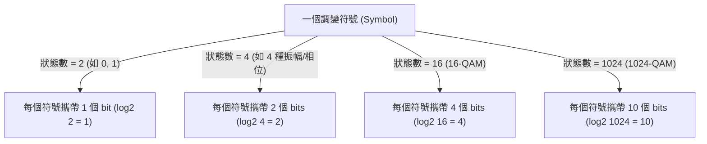

$$\text{Bits per Symbol} = \log_2(\text{狀態總數})$$

> **直觀比喻**：
> - 符號是一輛輛開出去的「貨車」（符號率 Baud Rate 即每秒發出幾輛車）。
> - 位元是貨車上裝載的「貨物」（位元率 Bit Rate 即每秒運送了多少貨物）。
> - 提升傳輸率有兩種方法：**把車開得更快（提高頻寬）**，或是**每輛車裝更多貨物（高階調變）**！

---

## 1. 振幅移鍵 (Amplitude Shift Keying, ASK)

### 1.1 二元振幅移鍵 (Binary ASK, BASK)
BASK 是最直觀的調變方式（又稱 OOK, On-Off Keying）：
- **傳送 Bit 1**：發射振幅為 $A$ 的載波波形 $A\cos(2\pi f_c t)$。
- **傳送 Bit 0**：發射振幅為 $0$（完全不發射訊號）。

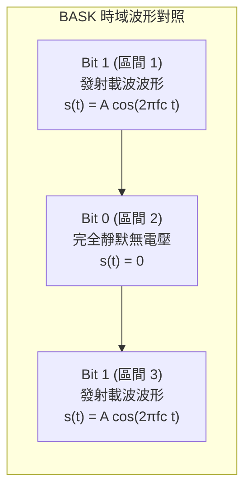

#### BASK 數學模型：
$$s(t) = \begin{cases} A \cos(2\pi f_c t), & \text{傳送 bit } 1 \\ 0, & \text{傳送 bit } 0 \end{cases}$$

#### BASK 硬體實現結構：
BASK 只需要一個乘法器（Multiplier）與本地振盪器（Oscillator）：

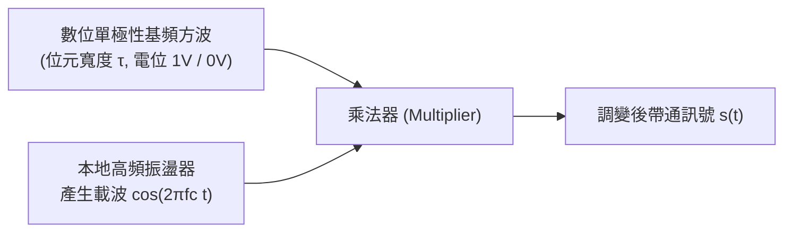

#### 脈衝時間 $\tau$ 與頻寬/位元率的關係：
- 單一脈衝時間為 $\tau$（秒）。
- **位元傳輸率 (Bit Rate)**：$\text{Bit Rate} = \frac{1}{\tau}\text{ bps}$。
- **有效頻寬 (Effective Bandwidth)**：$\text{Effective BW} \propto \frac{1}{\tau}$。
  - 脈衝拉長（$\tau \uparrow$）$\implies$ 傳輸速度變慢（Bit Rate $\downarrow$）$\implies$ 佔用頻寬變小（BW $\downarrow$）。
  - 脈衝壓縮（$\tau \downarrow$）$\implies$ 傳輸速度變快（Bit Rate $\uparrow$）$\implies$ 佔用頻寬變大（BW $\uparrow$）。

---

### 1.2 多階振幅移鍵 (M-ary ASK, 如 4-ASK)
如果我們不只用「有波/無波」，而是定義 **4 種不同振幅等級**：

| 傳送位元組合 | 代表符號 (Symbol) | 峰值振幅大小 |
|:---:|:---:|:---:|
| `00` | 符號 0 | $0.25 A$ |
| `01` | 符號 1 | $0.50 A$ |
| `10` | 符號 2 | $0.75 A$ |
| `11` | 符號 3 | $1.00 A$ |

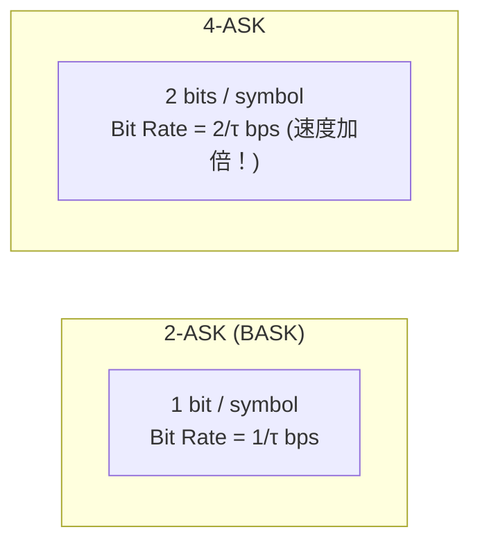

> **代價與限制**：
> 振幅越大，代表發射功率越高（$\text{Power} \propto A^2$）。若要區分更多振幅等級（如 32-ASK），相鄰振幅差值極小，極易受雜訊干擾而誤判。

---

## 2. 相位移鍵 (Phase Shift Keying, PSK)

在無線通訊中，振幅很容易受到大氣衰減與障礙物干擾；**保持振幅固定，改為改變訊號的「相位」**，抗雜訊能力遠優於 ASK。

### 2.1 二元相位移鍵 (Binary PSK, BPSK)
- **傳送 Bit 0**：相位偏移 $0^\circ$（波形為 $+\cos(2\pi f_c t)$）。
- **傳送 Bit 1**：相位偏移 $180^\circ$（波形顛倒，為 $-\cos(2\pi f_c t)$）。

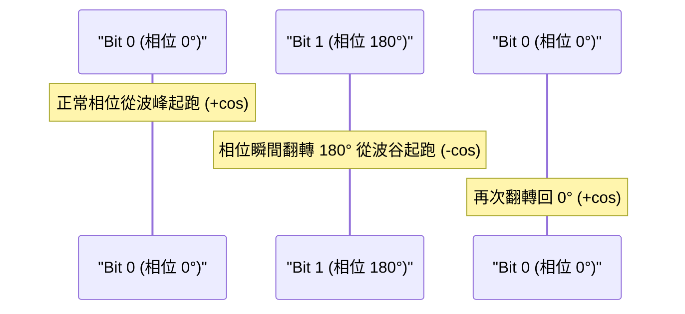

#### BPSK 硬體實現：
將位元流轉為雙極性脈衝（$+1\text{V}$ 代表 0，$-1\text{V}$ 代表 1），再直接與載波相乘：

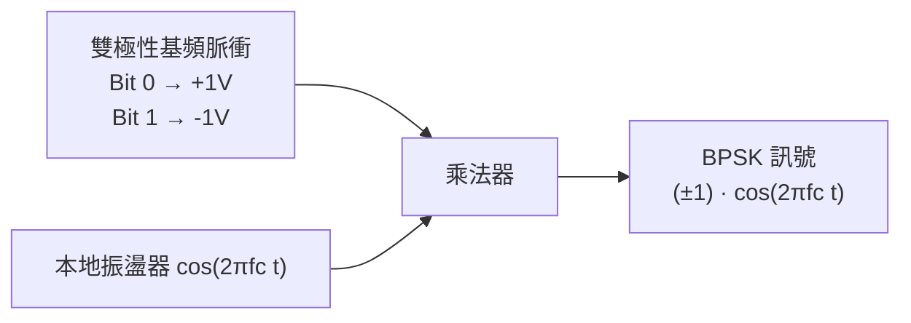

---

### 2.2 四相相位移鍵 (Quadrature PSK, QPSK)
QPSK 每次傳送 **2 個位元**，利用 4 個互相間隔 $90^\circ$ 的正交相位表示：

| 位元組合 (2 bits) | 相位偏移 (Phase) | 對應三角函數疊加 |
|:---:|:---:|:---:|
| `11` | $45^\circ$ ($\pi/4$) | $+\cos(x) + \sin(x)$ |
| `01` | $135^\circ$ ($3\pi/4$) | $-\cos(x) + \sin(x)$ |
| `00` | $225^\circ$ ($5\pi/4$) | $-\cos(x) - \sin(x)$ |
| `10` | $315^\circ$ ($7\pi/4$) | $+\cos(x) - \sin(x)$ |

#### 為什麼 $\pm\cos(x) \pm\sin(x)$ 恰好代表四個相位？（幾何疊加原理）
根據三角函數疊加公式：
$$\cos(x) + \sin(x) = \sqrt{2}\left(\frac{1}{\sqrt{2}}\cos x + \frac{1}{\sqrt{2}}\sin x\right) = \sqrt{2}\cos(x - 45^\circ)$$
$$-\cos(x) + \sin(x) = \sqrt{2}\cos(x - 135^\circ)$$

4 種正負號組合恰好均勻切分圓周的四個象限（$45^\circ, 135^\circ, 225^\circ, 315^\circ$）！

---

### 2.3 QPSK 發射端硬體實現架構（2 個 BPSK 的平行組合）

QPSK 本質上就是 **兩個平行的 BPSK** 同時在同一個頻率上傳送：

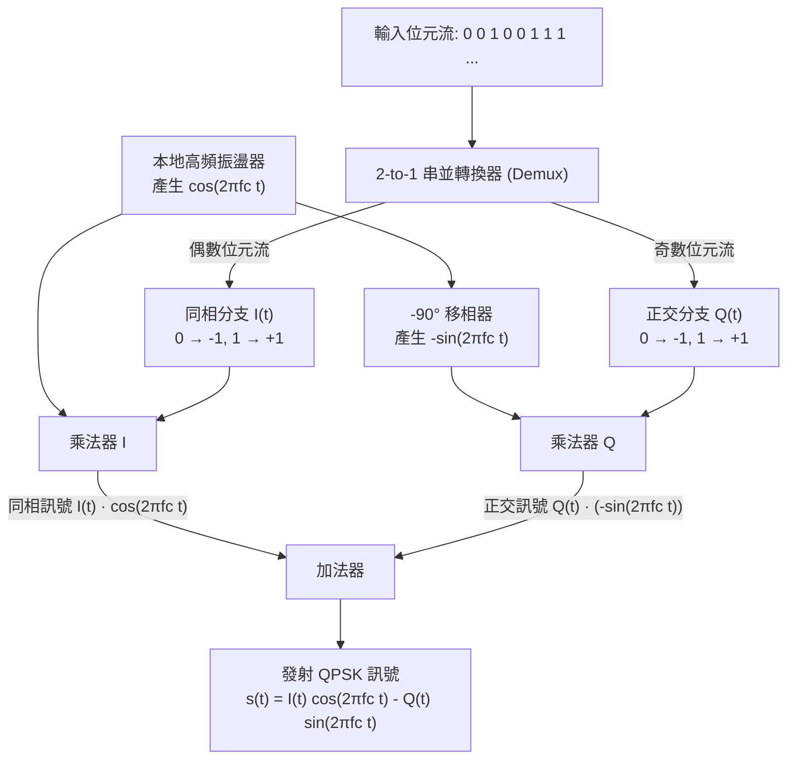

- **同相載波 (In-phase carrier)**：$\cos(2\pi f_c t)$，相位為 $0^\circ$。
- **正交載波 (Quadrature carrier)**：$-\sin(2\pi f_c t)$，相位差為 $90^\circ$。
- **正交性 (Orthogonality)** 確保這兩路訊號疊加在一起發射後，接收端能毫無干擾地將兩路資料各自獨立還原！

---

## 3. 結合振幅與相位：星座圖與正交振幅調變 (QAM)

### 3.1 什麼是星座圖 (Constellation Diagram)？
當訊號同時改變振幅與相位時，波形難以用肉眼辨識。工程上使用二維極座標平面的 **星座圖** 來視覺化所有符號：

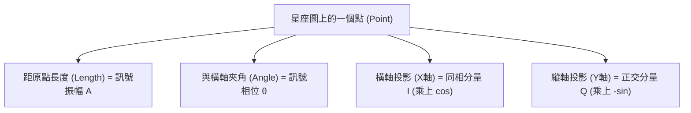

#### BASK、BPSK、QPSK 星座圖視覺對照：

```
      BASK (2 種狀態)               BPSK (2 種狀態)               QPSK (4 種狀態)
            Q                             Q                             Q
            │                             │                        01   │   11
            │                             │                         ●   │   ●
            │                             │                             │
    ────────┼───●────●─── I       ───●────┼────●─── I           ────────┼──────── I
            │   0    1             0(-1)  │   1(+1)                     │
            │                             │                         ●   │   ●
            │                             │                        00   │   10
```

---

### 3.2 正交振幅調變 (QAM - Quadrature Amplitude Modulation)
QAM 同時調整振幅與相位，形成規律的二維方格網（如 16-QAM, 64-QAM, 1024-QAM）：

```
                       16-QAM 星座圖 (4 bits / symbol)
                                      Q (縱軸)
                                      ▲
                         0000   0100  │  1100   1000
                          ●      ●    │   ●      ●    (Q = +3)
                                      │
                         0001   0101  │  1101   1001
                          ●      ●    │   ●      ●    (Q = +1)
                      ────────────────┼────────────────► I (橫軸)
                         0011   0111  │  1111   1011
                          ●      ●    │   ●      ●    (Q = -1)
                                      │
                         0010   0110  │  1110   1010
                          ●      ●    │   ●      ●    (Q = -3)
                                      ▼
                        (I=-3) (I=-1)   (I=+1) (I=+3)
```

#### 觀念大辨正 (Key Takeaway)：
- ❌ **常見錯誤觀念**：「1024-QAM 所需的頻率頻寬 (Hz) 比 16-QAM 更大。」
- ✔ **正確觀念**：
  - **頻率頻寬（Hz）完全相同**（因為符號時間 $\tau$ 相同）！
  - 1024-QAM 每個符號攜帶 $10\text{ bits}$（$\log_2 1024 = 10$），16-QAM 每個符號攜帶 $4\text{ bits}$（$\log_2 16 = 4$）。
  - **在相同的通道頻寬下，1024-QAM 的資料傳輸速率 (bps) 是 16-QAM 的 2.5 倍！**

---

### 3.3 QAM 的數學本質推導 (Mathematical Proof)
為什麼任意振幅與相位的正弦波，都能直接拆成 $I$ 與 $Q$ 兩路發送？

利用三角函數餘弦和角公式：

$$\cos(x + y) = \cos(x)\cos(y) - \sin(x)\sin(y)$$

令 $x = 2\pi f_c t$，相位為 $y = \theta$，則帶通訊號為：

$$s(t) = A\cos(2\pi f_c t + \theta) = A\cos(2\pi f_c t)\cos\theta - A\sin(2\pi f_c t)\sin\theta$$

重新分組：

$$s(t) = \underbrace{\left[ A\cos\theta \right]}_{I(t)\text{ (X 軸座標)}} \cdot \cos(2\pi f_c t) + \underbrace{\left[ A\sin\theta \right]}_{Q(t)\text{ (Y 軸座標)}} \cdot \left(-\sin(2\pi f_c t)\right)$$

> **驚人結論**：
> 發送端根本**不需要設計複雜的連續移相器與可變放大器**！
> 只要計算出星座點座標 $(I, Q)$，分別產生兩組階梯電壓 $I(t)$ 與 $Q(t)$，乘上固定頻率的 $\cos$ 與 $-\sin$ 載波後相加，就能發射出任何指定振幅與相位的合成波！

---

### 3.4 16-QAM 傳輸實例推導
假設我們要傳送 16 個位元：`1101 0111 1100 0110`

1. **分組為 4 個符號**（每個符號 4 bits）：
   - 符號 1：`1101` $\implies$ 查表星座圖座標 $(I, Q) = (+1, +1)$
   - 符號 2：`0111` $\implies$ 查表星座圖座標 $(I, Q) = (-1, -1)$
   - 符號 3：`1100` $\implies$ 查表星座圖座標 $(I, Q) = (+1, +3)$
   - 符號 4：`0110` $\implies$ 查表星座圖座標 $(I, Q) = (-1, -3)$

2. **生成同相與正交電壓序列**：
   - $I(t)$ 電位序列：$[+1\text{V}, -1\text{V}, +1\text{V}, -1\text{V}]$
   - $Q(t)$ 電位序列：$[+1\text{V}, -1\text{V}, +3\text{V}, -3\text{V}]$

3. **發射訊號**：
   $$s(t) = I(t)\cos(2\pi f_c t) + Q(t)(-\sin(2\pi f_c t))$$

---

## 4. 接收端解調 (Demodulation) 與判決原則

接收端的天線收到空氣中傳來的訊號 $s(t)$ 後，如何分毫不差地把 $I(t)$ 與 $Q(t)$ 拆解出來？

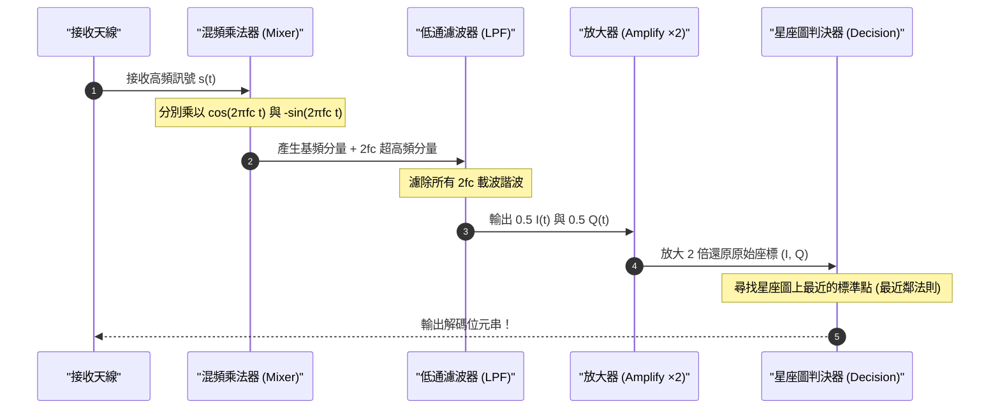

---

### 4.1 數學深度拆解：正交性如何分離 $I(t)$ 與 $Q(t)$？

#### 提取同相分量 $I(t)$：
將接收到的 $s(t)$ 乘上同相載波 $\cos(2\pi f_c t)$：

$$s(t) \cdot \cos(2\pi f_c t) = \left[ I(t)\cos(2\pi f_c t) - Q(t)\sin(2\pi f_c t) \right] \cdot \cos(2\pi f_c t)$$
$$= I(t)\cos^2(2\pi f_c t) - Q(t)\sin(2\pi f_c t)\cos(2\pi f_c t)$$

利用倍角公式 $\cos^2(\theta) = 0.5(1 + \cos 2\theta)$ 及 $\sin\theta\cos\theta = 0.5\sin 2\theta$：

$$= 0.5 I(t) + \underbrace{0.5 I(t)\cos(2\pi \cdot 2f_c t)}_{\text{頻率 } 2f_c \text{ 超高頻}} - \underbrace{0.5 Q(t)\sin(2\pi \cdot 2f_c t)}_{\text{頻率 } 2f_c \text{ 超高頻}}$$

1. **通過低通濾波器 (LPF)**：所有 $2f_c$（例如 $5\text{ GHz} \to 10\text{ GHz}$）高頻分量全部被濾除為 0。
2. **濾波後輸出**：$0.5 I(t)$。
3. **放大器放大 2 倍**：$2 \times 0.5 I(t) = I(t)$（**同相分量完美還原**！$Q$ 分量完全被抵消）。

---

#### 提取正交分量 $Q(t)$：
將接收到的 $s(t)$ 乘上正交載波 $(-\sin(2\pi f_c t))$：

$$s(t) \cdot (-\sin(2\pi f_c t)) = -I(t)\cos(2\pi f_c t)\sin(2\pi f_c t) + Q(t)\sin^2(2\pi f_c t)$$
$$= 0.5 Q(t) - \underbrace{0.5 I(t)\sin(2\pi \cdot 2f_c t)}_{\text{頻率 } 2f_c \text{ 超高頻}} - \underbrace{0.5 Q(t)\cos(2\pi \cdot 2f_c t)}_{\text{頻率 } 2f_c \text{ 超高頻}}$$

1. **通過低通濾波器 (LPF)**：濾除 $2f_c$ 高頻。
2. **放大器放大 2 倍**：$2 \times 0.5 Q(t) = Q(t)$（**正交分量完美還原**！$I$ 分量完全被抵消）。

---

### 4.2 星座圖幾何判決與雜訊位元錯誤 (Bit Error)

真實大氣中存在熱雜訊（Noise）。接收端解調出的座標不會完美落在整數點，而是會產生偏移（如下圖星號 $\bigstar$ 所示）：

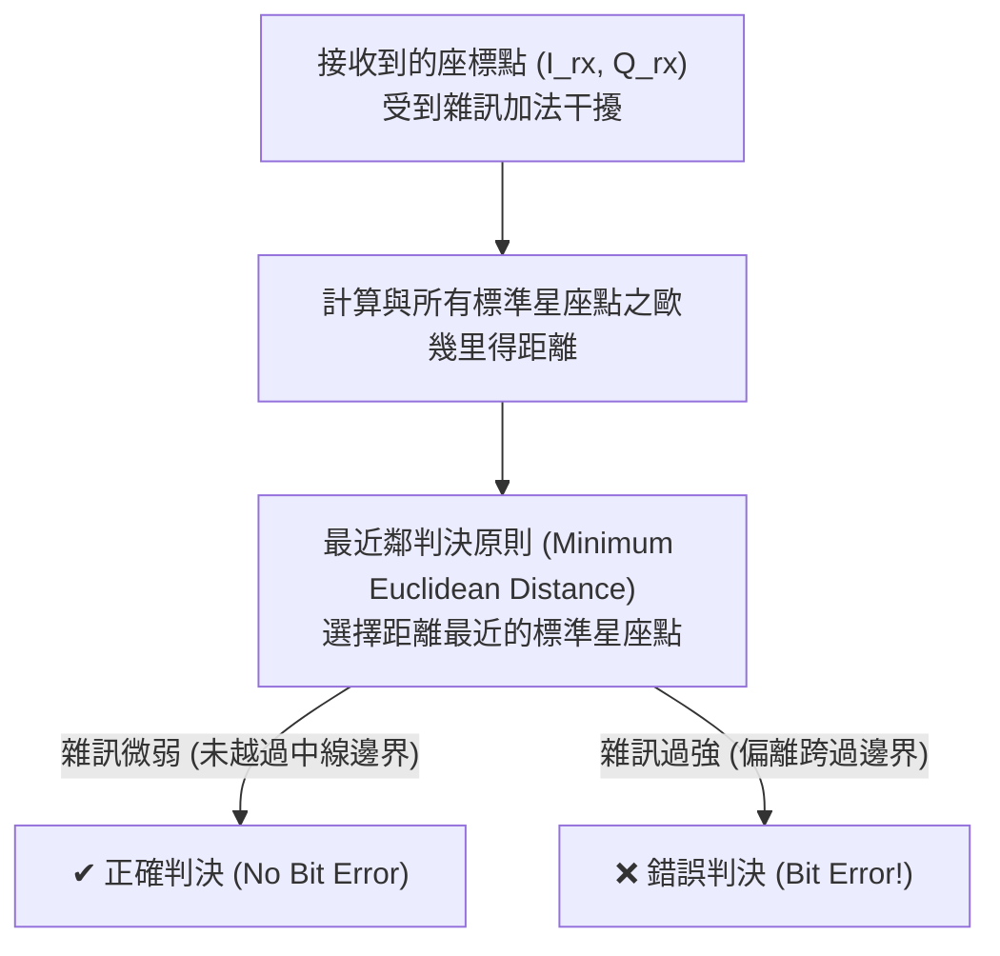

```
                   雜訊導致判決錯誤示意圖
                              Q
                              │
                     01       │       11
                      ○       │       ○
                              │     ★ (接收點偏到這裡)
               ───────────────┼─────────────── I
                              │   ↗ (受到強烈雜訊推擠)
                      ○       │  ● 10 (原發射點)
                     00       │
```

- **訊噪比 (SNR, Signal-to-Noise Ratio)**：訊號功率與雜訊功率的比值。
- **物理規律**：
  $$\text{SNR} \downarrow \implies \text{接收點偏離半徑} \uparrow \implies \text{跨越判決邊界機率} \uparrow \implies \text{位元錯誤率 (BER)} \uparrow$$

---

## 5. 適應性調變與編碼機制 (Adaptive Modulation & Coding, AMC)

### 5.1 調變方式的權衡抉擇 (Trade-off)

在不同通道環境下，該選擇哪種調變技術？

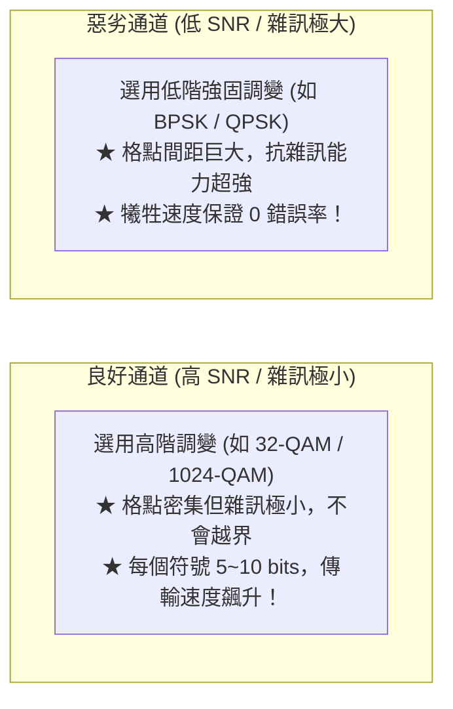

| 調變技術 | 每個符號攜帶位元 | 速度 (Bit Rate) | 抗雜訊能力 (Robustness) | 適用場景 |
|:---:|:---:|:---:|:---:|:---:|
| **BPSK** | $1\text{ bit}$ | 基準 ($1\times$) | ★★★★★ (極強) | 遠距離、訊號微弱、嚴重干擾 |
| **QPSK** | $2\text{ bits}$ | $2\times$ | ★★★★☆ (強) | 訊號普通、基本通訊 |
| **16-QAM** | $4\text{ bits}$ | $4\times$ | ★★★☆☆ (中) | 訊號良好（如辦公室內 Wi-Fi） |
| **64-QAM / 256-QAM** | $6 \sim 8\text{ bits}$ | $6 \sim 8\times$ | ★★☆☆☆ (弱) | 高速行動網路近距離 |
| **1024-QAM** | $10\text{ bits}$ | $10\times$ | ★☆☆☆☆ (極弱) | Wi-Fi 6 / 5G 極近距離無遮蔽傳輸 |

---

### 5.2 通道編碼 (Channel Coding) 與編碼率 (Coding Rate, $R$)

單靠調變還不夠，通訊系統會在資料中加入冗餘保護（通道編碼）：

$$R = \text{Coding Rate} = \frac{\text{有效資料位元數 (Useful bits)}}{\text{實際發送總位元數 (Total bits)}}$$

#### 範例解析：要發送原始位元 `1101`
1. **若設定編碼率 $R = 1/3$**（每個位元重複 3 次保護）：
   - 編碼後序列：`111 111 000 111`（共 12 bits）。
   - 若採用 16-QAM（4 bits/symbol）發送，共需 3 個符號：`1111`、`1100`、`0111`。
2. **若設定編碼率 $R = 1/5$**（每個位元重複 5 次保護）：
   - 編碼後序列：`11111 11111 00000 11111`（共 20 bits），抗雜訊更強！

---

### 5.3 MCS 動態調適策略：$\epsilon$-Greedy 演算法

在現代 4G/5G 與 Wi-Fi 中，基地台會將調變與編碼率打包成 **MCS (Modulation and Coding Scheme)** 指標（例如 MCS 0 到 MCS 15）：

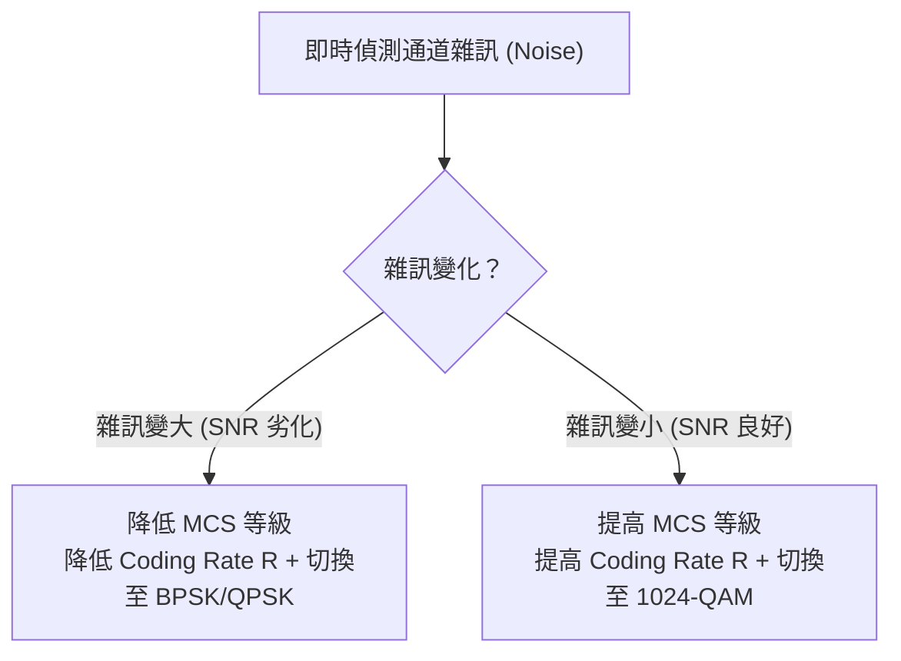

#### $\epsilon$-Greedy 決策機制：
- **以 $1 - \epsilon$ 的機率（利用 Exploitation）**：選用當前估計吞吐量（Throughput）最高的最佳 MCS。
- **以 $\epsilon$ 的小機率（探索 Exploration）**：隨機嘗試其他更高或更低的 MCS，以探測環境通道是否有好轉或劣化。

---

### 5.4 訊框設計：接收端如何得知傳送端選用了哪種 MCS？

既然傳送端會動態切換 MCS，接收端在收到訊號前**根本不知道這批資料是用 BPSK 還是 1024-QAM 調變的**，該如何解調？

解決方案在於 **訊框（Frame）的結構分層設計**：

```
                    通訊訊框 (Frame) 的結構
┌──────────────────────────────────────┬────────────────────────────────────────────┐
│      標頭 (Frame Header)             │            資料酬載 (Payload)              │
├──────────────────────────────────────┼────────────────────────────────────────────┤
│ • 來源位址 (Source Address)          │                                            │
│ • 目的位址 (Destination Address)     │   真正傳輸的資料內容 (Data)                 │
│ • 指派的 MCS (例如: 1024-QAM, R=3/4) │                                            │
└──────────────────────────────────────┴────────────────────────────────────────────┘
        ▲                                                      ▲
        │                                                      │
【永遠使用最慢、最穩固的調變】                         【使用 Header 指定的高速 MCS】
 (例如 BPSK / QPSK + 低編碼率)                          (例如 1024-QAM + 高編碼率)
```

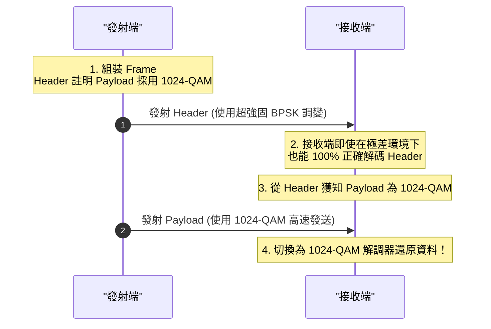

> **核心精華**：
> **Header 是解開 Payload 的鑰匙**。因此 Header 永遠採用最慢速、最耐雜訊的低階調變（如 BPSK），確保接收端在任何嚴苛條件下都能順利讀出 MCS 指標，再以對應模式解調高階 Payload！

---

## 本章精華總結表

| 調變技術 | 改變維度 | 每個符號位元數 | 星座圖特徵 | 關鍵數學通式 / 性質 |
|---|---|:---:|---|---|
| **BASK** | 振幅 ($0$ 或 $A$) | $1$ bit | I 軸上 2 個點 | $s(t) = A\cos(2\pi f_c t)$ 或 $0$；$\text{BW} \propto 1/\tau$ |
| **4-ASK** | 4 種振幅等級 | $2$ bits | I 軸上 4 個點 | 振幅越大功率需求越高 ($P \propto A^2$) |
| **BPSK** | 相位 ($0^\circ, 180^\circ$) | $1$ bit | I 軸上對稱 2 點 ($\pm 1$) | $(\pm 1)\cos(2\pi f_c t)$；抗雜訊優於 ASK |
| **QPSK** | 4 種正交相位 | $2$ bits | 4 個象限圓周上 4 點 | $I(t)\cos(2\pi f_c t) - Q(t)\sin(2\pi f_c t)$ |
| **QAM** | 同時調變振幅與相位 | $\log_2 M$ bits | 2D 矩陣網格格點 | $A\cos(2\pi f_c t + \theta) = I\cos(2\pi f_c t) - Q\sin(2\pi f_c t)$ |
| **解調 (Rx)** | 乘載波 $\to$ LPF $\to$ 放大 | — | 最近鄰距離判決 | 利用正交性徹底分離 I 與 Q 兩路通道 |
| **AMC** | 動態調整 MCS | 彈性 | 依 SNR 動態切換 | $\epsilon$-greedy 探索最佳平衡；Header 恆用 BPSK |

---

## ❓ 初學者常見疑問與思維誤區 (Q&A)

??? question "Q1: 1024-QAM 傳輸速度是 16-QAM 的 2.5 倍，為什麼 Wi-Fi 和 5G 不直接永遠鎖定在 1024-QAM 或 4096-QAM？"
    **解答**：
    因為「星座點密度」與「抗雜訊能力」存在著嚴格的物理權衡（Trade-off）：
    - **16-QAM**：二維平面上只有 16 個點，相鄰點之間的判決安全邊界非常寬廣。即使遇到中等強度的雜訊干擾，接收點偏移後依然能落在正確的決策區間內。
    - **1024-QAM**：在相同的發射功率限制下，二維平面必須硬塞入 1024 個點，相鄰點間距極端狹窄。只要環境有一點微弱的雜訊、多路徑干擾或人體阻擋，接收點就會輕易跨越邊界被誤判為鄰居點，引發嚴重的位元錯誤（Bit Error）。
    
    因此，只有當手機距離基地台非常近且無遮蔽（極高 SNR）時系統才會跑 1024-QAM；一旦距離拉遠或訊號減弱，自適應機制（AMC）必須立即自動降階切換至 QPSK 或 16-QAM 以確保資料傳輸的正確性。

??? question "Q2: 為什麼同相載波 $\cos(2\pi f_c t)$ 與正交載波 $-\sin(2\pi f_c t)$ 在同一個頻率 $f_c$ 發送，接收端卻完全不會把它們混在一起？"
    **解答**：
    這完全歸功於三角函數在數學上的**正交性 (Orthogonality)**：
    - 當接收端欲提取同相分量 $I(t)$ 時，將接收訊號乘上 $\cos(2\pi f_c t)$：
      - $I(t)$ 部分形成 $\cos^2(2\pi f_c t) = 0.5 + 0.5\cos(4\pi f_c t)$（包含直流基頻 $0.5$ 與兩倍頻 $2f_c$）。
      - $Q(t)$ 部分形成 $-\sin(2\pi f_c t)\cos(2\pi f_c t) = -0.5\sin(4\pi f_c t)$（**純兩倍頻 $2f_c$，完全不含任何直流基頻！**）。
    - 接著訊號通過低通濾波器（LPF）濾除所有 $2f_c$ 高頻諧波後，$Q(t)$ 的影響被**徹底歸零消除**，只保留下乾淨的 $0.5 I(t)$！同理，乘以 $-\sin(2\pi f_c t)$ 濾波後也會將 $I(t)$ 完全歸零消除。

??? question "Q3: 既然發射端會隨時更換 MCS（調變與編碼等級），接收端在收到訊號的第一瞬間如何知道該用哪種方式解調？"
    **解答**：
    關鍵在於**訊框標頭 (Frame Header) 的非對稱保護機制**：
    1. 每個通訊訊框在結構上都由「標頭 (Header)」與「資料酬載 (Payload)」兩部分組成。
    2. Header 內詳細記錄了該 Payload 所採用的 MCS 等級（如 1024-QAM, $R=3/4$）。
    3. **Header 永遠使用傳輸速度最慢、抗雜訊能力最強的基礎調變（如 BPSK / QPSK）進行發射**。
    
    因此，無論當時通道環境多麼惡劣，接收端都能 100% 正確解讀出 Header 內容；獲知 MCS 等級後，接收電路便能毫秒級切換至對應的解調模式來還原高速的 Payload 資料！

---

## 實體層總結

恭喜你！至此你已經完整掌握了實體層的全部核心底層原理：
從 **正弦波基礎** $\to$ **方波傅立葉級數** $\to$ **頻寬與頻譜搬移** $\to$ **無線調變、星座圖、I/Q 正交分解與適應性 MCS 機制**。

實體層成功將電腦中的 0 與 1 位元轉換為高頻電磁波，克服了大氣雜訊與通道衰減，將訊號穩定送達接收端並精確還原！
