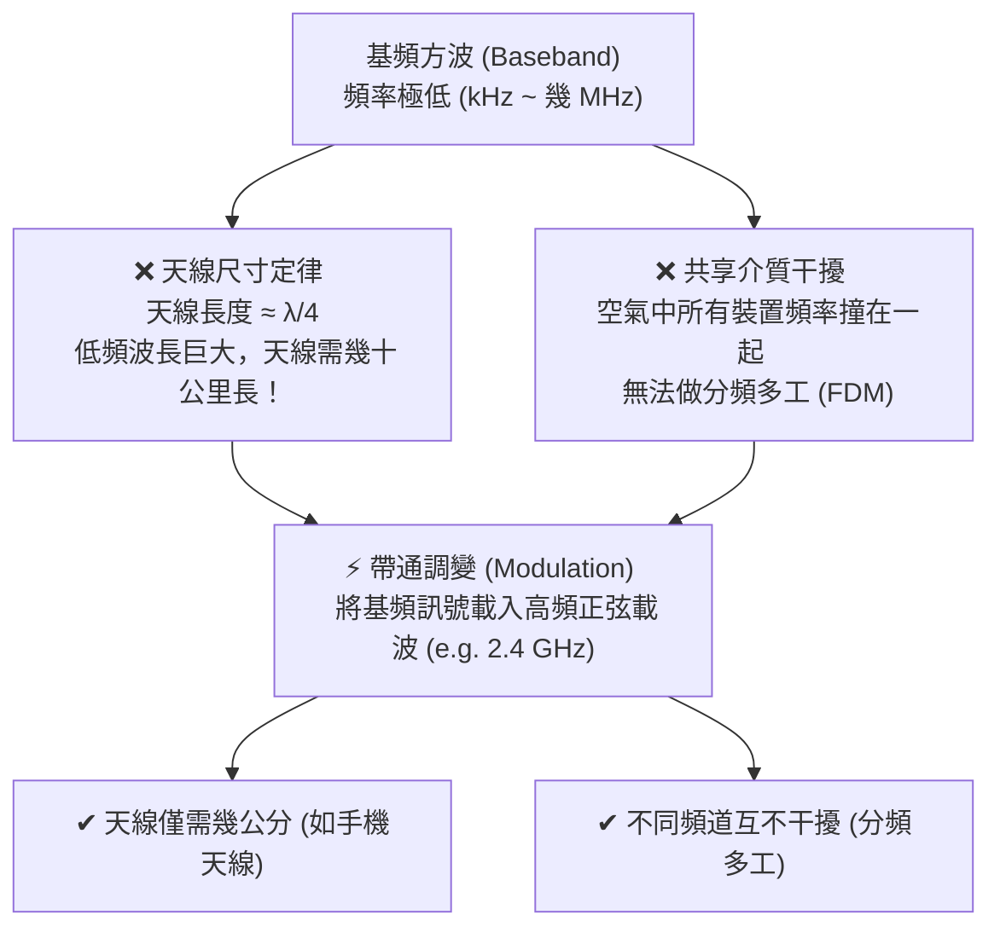

# 5. 無線傳輸與調變技術 (Wireless Transmission & Modulation)

在前面的章節中，我們從單一**正弦波**出發，了解了**方波的傅立葉構成**與**頻寬極限**。本節將帶你進入實體層最精彩的篇章：**如何將資料透過無線電波（空中大氣）發射到千家萬戶？**

---

## 為什麼無線傳輸不能直接發射數位方波？

在有線電纜中，我們可以直接用高低電壓（基頻傳輸）送出 0 與 1。但在無線通訊中，這在物理上是**完全不可行**的，原因有二：



1. **天線尺寸的物理定律 (Antenna Size)**：
   - 物理學證明：天線的有效長度必須與電磁波的波長成正比（通常為 $\frac{\lambda}{4}$ 或 $\frac{\lambda}{2}$）。
   - 若直接發射 $3\text{ kHz}$ 的音訊基頻訊號，其波長 $\lambda = \frac{c}{f} = \frac{3 \times 10^8}{3000} = 100\text{ 公里}$，你需要建造一座 **25 公里長的天線**！
   - 若將訊號調變到 $2.4\text{ GHz}$（Wi-Fi 頻段），波長縮短為 $\lambda = \frac{3 \times 10^8}{2.4 \times 10^9} = 12.5\text{ cm}$，天線只需 **$3.1\text{ cm}$**，能輕鬆塞入手機內部。
2. **頻譜共享與多工 (Frequency-Division Multiplexing, FDM)**：
   - 空氣是所有人共用的介質。如果大家都發送低頻基頻訊號，所有訊號將在空中混成一團雜訊。
   - 透過調變，可以把不同電台、不同 Wi-Fi 頻道「搬移」到不同的高頻載波（Carrier）上，彼此井水不犯河水。

---

## 調變的本質：回到正弦波通式

還記得第一節學過的正弦波通式嗎？

$$s(t) = A(t) \cos(2\pi f(t) t + \phi(t))$$

**調變 (Modulation)** 的本質，就是以一個高頻的純淨正弦波作為「載波 (Carrier Wave)」，並**利用要傳送的數位位元 (0 與 1)，去動態改變載波的三大物理量之一（或組合）**：

```
                    ┌── 振幅調變 ──> ASK (Amplitude Shift Keying)
  數位位元 (0/1) ───┼── 頻率調變 ──> FSK (Frequency Shift Keying)
                    ├── 相位調變 ──> PSK (Phase Shift Keying)
                    └── 振幅 + 相位 ─> QAM (Quadrature Amplitude Modulation)
```

---

## 三大基本數位調變技術

```
位元流：         1             0             1             1
            +-------+                     +-------+     +-------+
基頻訊號：  |       |                     |       |     |       |
            +       +---------------------+       +-----+       +----

載波 (高頻)： ~~~~~~~~~~~~~~~~~~~~~~~~~~~~~~~~~~~~~~~~~~~~~~~~~~~~~~~~~

ASK (調振幅)   /\/\/\/\                     /\/\/\/\      /\/\/\/\
            (有訊號=1)      (平坦無訊號=0)   (有訊號=1)    (有訊號=1)

FSK (調頻率)   /\/\/\/\/\     \  /  \  /    /\/\/\/\/\    /\/\/\/\/\
             (高頻密=1)       (低頻疏=0)     (高頻密=1)    (高頻密=1)

PSK (調相位)   /\/\  \/\     /\/\  \/\     /\/\  \/\     /\/\  \/\
                   ^             ^             ^
                (遇到0時波形相位顛倒 180 度翻轉)
```

### 1. ASK (Amplitude Shift Keying, 振幅偏移調變)
- **原理**：用載波的「振幅大小」代表位元。
- **OOK (On-Off Keying)**：最簡單的 ASK，有載波輸出代表 `1`，無載波（振幅為 0）代表 `0`。
- **優缺點**：電路最簡單，但**極易受雜訊干擾與訊號衰減影響**（空氣中的雜訊通常直接作用在振幅上）。

### 2. FSK (Frequency Shift Keying, 頻率偏移調變)
- **原理**：用載波的「頻率高低」代表位元。
  - 頻率 $f_1$ 代表 `1`，頻率 $f_2$ 代表 `0`。
- **優缺點**：抗雜訊能力優於 ASK（因為干擾通常不影響頻率），但**需要佔用較寬的頻譜空間**。早期低速數據機與藍牙基本速率常用。

### 3. PSK (Phase Shift Keying, 相位偏移調變)
- **原理**：載波的振幅與頻率保持不變，用載波的「初始相位角度」來代表位元。
- **優點**：**抗干擾能力最強**，且功率利用率極高，是現代無線通訊（Wi-Fi、4G/5G、衛星通訊）的核心基礎。

#### PSK 家族演進：
- **BPSK (Binary PSK)**：使用 2 種相位（$0^\circ, 180^\circ$）。
  - 每個 Symbol 攜帶 **$1\text{ bit}$**（$\log_2(2) = 1$）。
- **QPSK (Quadrature PSK)**：使用 4 種正交相位（$45^\circ, 135^\circ, 225^\circ, 315^\circ$）。
  - 每個 Symbol 攜帶 **$2\text{ bits}$**（$\log_2(4) = 2$），**在相同頻寬下傳輸速率直接加倍！**
- **8-PSK**：使用 8 種相位，每個 Symbol 攜帶 **$3\text{ bits}$**。

---

## 現代高速無線的主力：QAM (正交振幅調變)

當我們想在一個 Symbol 內塞入更多位元時（例如 16 個狀態），如果單純使用 16-PSK，圓周上的 16 個點會靠得太近，微小的雜訊就會造成相位誤判。

工程師的解決方案是：**同時調變載波的「振幅」與「相位」**，這就是 **QAM (Quadrature Amplitude Modulation)**。

```
QPSK (4 點, 2 bits/symbol)         16-QAM (16 點網格, 4 bits/symbol)
        Q (正交軸)                          Q
        |                                   |  *   *   *   *
    *   |   *                               |  *   *   *   *
  ------+------ I (同相軸)               ---+---+---+---+--- I
    *   |   *                               |  *   *   *   *
        |                                   |  *   *   *   *
```

### 星狀圖 (Constellation Diagram)
- 星狀圖上的每一個「點」代表一個可發送的符號狀態（Symbol）。
- 點離原點的距離代表**振幅**，與正橫軸的夾角代表**相位**。

### QAM 階數與傳輸速度：
- **16-QAM**：$2^4 = 16$ 個點，每個 Symbol 送 **4 bits**（Wi-Fi 4 常用）。
- **64-QAM**：$2^6 = 64$ 個點，每個 Symbol 送 **6 bits**（數位電視 DVB、Wi-Fi 5）。
- **256-QAM**：$2^8 = 256$ 個點，每個 Symbol 送 **8 bits (1 Byte)**（Wi-Fi 5 / 4G LTE-A）。
- **1024-QAM**：$2^{10} = 1024$ 個點，每個 Symbol 送 **10 bits**（Wi-Fi 6）。
- **4096-QAM**：$2^{12} = 4096$ 個點，每個 Symbol 送 **12 bits**（Wi-Fi 7）。

> **代價與權衡**：星狀圖點數越多，點與點之間的距離越密。接收端需要極高的**訊噪比 (SNR)** 才能精準辨識；一旦訊號減弱或有干擾，誤碼率會急遽飆升。

---

## 數位調變技術大總結

| 調變技術 | 調變參數 | 每個符號位元數 (Bits/Symbol) | 抗雜訊能力 | 頻譜效率 | 主要應用 |
|---|---|---|---|---|---|
| **ASK / OOK** | 振幅 | 1 | 極差 | 低 | 光纖通訊開關、RFID、低價遙控器 |
| **FSK** | 頻率 | 1 | 中等 | 低 | 傳統傳真機、藍牙 Basic Rate、非接觸式卡片 |
| **BPSK** | 相位 (2 相) | 1 | **極強** | 低 | 深度太空通訊、GPS 衛星導航 |
| **QPSK** | 相位 (4 相) | 2 | **強** | 中 | 數位衛星電視 (DVB-S)、行動網路控制通道 |
| **64-QAM** | 振幅 + 相位 | 6 | 中等 | **高** | Wi-Fi 4/5、4G LTE |
| **1024-QAM** | 振幅 + 相位 | 10 | 需極高 SNR | **極高** | Wi-Fi 6、5G Sub-6GHz 高速模式 |

---

## ❓ 初學者常見疑問與思維誤區 (Q&A)

??? question "Q1: 「調變 (Modulation)」與上一節講的「編碼 (Encoding)」到底有什麼區別？"
    **解答**：
    兩者的工作領域與目的完全不同：
    - **編碼 (Line Coding)**：屬於**基頻 (Baseband)** 範疇。它是將二進位位元對應成合適的**電壓脈衝波形**，主要解決時脈同步、直流平衡問題（如曼徹斯特編碼），訊號頻譜仍集中在低頻，通常用於有線電纜。
    - **調變 (Modulation)**：屬於**通帶 / 帶通 (Passband)** 範疇。它是將訊號頻譜「搬移」到幾百 MHz 或幾 GHz 的**高頻正弦載波**上，主要解決天線發射尺寸與大氣頻譜多工問題，是所有無線通訊的必經步驟。

??? question "Q2: 為什麼手機走到離 Wi-Fi 分享器很遠的地方時，網速會自動變慢？"
    **解答**：
    這是現代無線網路的 **自適應調變與編碼 (Adaptive Modulation and Coding, AMC)** 機制在運作。
    - 當你**靠近分享器**時，訊號極強（SNR 高），晶片會自動切換至 **1024-QAM 或 256-QAM**，每個符號送出 8~10 bits，網速全開！
    - 當你**走進房間深處**，訊號衰減、雜訊變大（SNR 降低），如果繼續用 256-QAM 會產生大量錯包；晶片偵測到後會**自動降級為 16-QAM、QPSK 甚至 BPSK**（每個符號只送 1~2 bits）。雖然速率下降，但能保證連線不中斷。

??? question "Q3: 既然 4096-QAM 能傳 12 bits，為什麼我們不直接發明「100 萬-QAM」讓網速翻一萬倍？"
    **解答**：
    這再次呼應了第 3 節的 **夏農極限定理 (Shannon Limit)**！
    
    在 100 萬點的星狀圖上，每個點之間的電壓差可能小於幾十奈伏（$10^{-9}\text{V}$）。而在常溫環境下，導線和空氣分子的熱運動所產生的**熱雜訊（Johnson-Nyquist Noise）**就遠遠超過這個數值。雜訊會把所有的點模糊成一整團雜斑，接收端根本不可能辨識。**物理熱雜訊是調變階數永遠無法突破的終極鐵壁**。

---

## 下一步

我們已經完整走過了從正弦波、方波、傅立葉分析、頻寬極限到無線調變的完整通訊脈絡！

想了解承載這些訊號的實體媒介（雙絞線、光纖）與標準規格嗎？請前往下一節：[6. 傳輸媒介與標準規格](media.md)。
