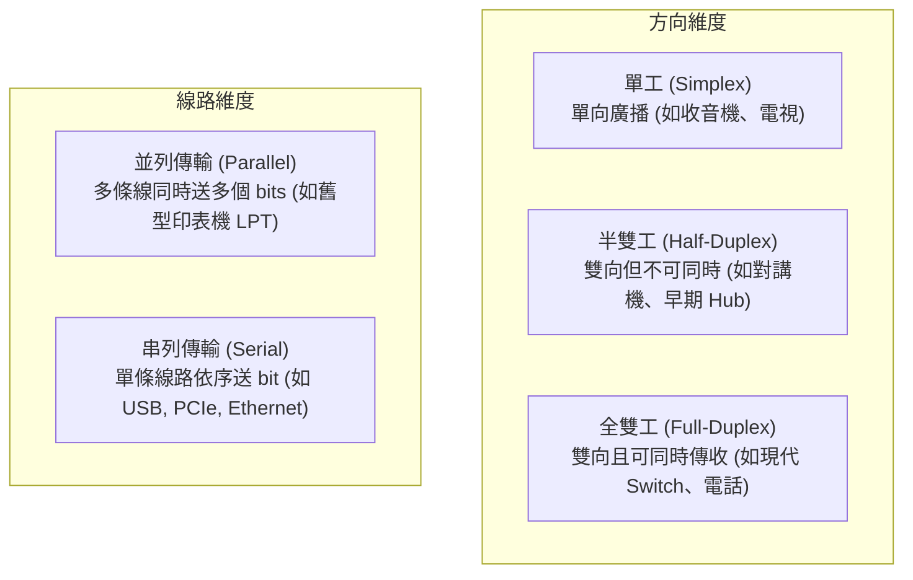

# 4. 基頻編碼與傳輸模式 (Baseband Transmission & Line Coding)

在理解了頻寬與方波的關係後，我們來看**有線網路（如乙太網路、USB、匯流排）**中，數位系統如何直接以電壓脈衝傳遞資料——這稱為**基頻傳輸 (Baseband Transmission)**。

---

## 什麼是基頻傳輸？

- **基頻訊號 (Baseband Signal)**：由數位電路直接產生的電壓波形，其頻譜從 $0\text{ Hz}$（直流 DC）延伸到某個截止頻率。
- **基頻傳輸**：不使用高頻載波，直接將編碼後的電壓方波訊號送上實體傳輸線（如雙絞線、同軸電纜）。通常適用於**短距離、有線封閉的專屬線路**。

---

## 為什麼不能直接用「高電位=1, 低電位=0」？

初學者最直覺的想法是：`1` 就給 $+5\text{V}$，`0` 就給 $0\text{V}$（這叫做 Unipolar NRZ）。但在實際網路工程中，這樣做會遭遇三大致命缺陷：

```
+5V |  +--------------------------+  (連續 100 個 1)
    |  |                          |  --> 接收端時脈偏差，不知道送了 99 個還是 101 個 1？
 0V +--+                          +-------------------------> 時間 t
```

1. **時脈同步問題 (Clock Synchronization)**：
   - 傳送端與接收端的內部震盪器（時脈 Clock）一定有微小的頻率偏差。
   - 如果資料出現長串連續的 `1` 或 `0`，訊號電壓將長時間維持一條直線，接收端找不到任何電壓跳變點來校正時脈，導致**位元計數失步**。
2. **直流漂移與直流分量 (DC Component / Baseline Wander)**：
   - 長時間偏向正電位會在變壓器或電容耦合電路中累積電荷，導致電壓基準線浮動（Baseline Wander），使後續的電壓判決門檻失準。
3. **缺乏基本錯誤偵測能力**：
   - 如果線路斷線（0V），接收端可能會誤以為傳送端一直在傳送 `0`。

為了克服這些問題，必須將原始位元經過**線路編碼 (Line Coding)** 轉換。

---

## 常見線路編碼技術 (Line Coding Schemes)

```
位元序列：        1       0       1       1       0       0       1
               +---+   +---+   +---+---+               +---+
NRZ-L          |   |   |   |   |       |               |   |
             --+   +---+   +---+       +---------------+   +---

                 +-------+       +---+   +---------------+
NRZ-I            |       |       |   |   |               |
             ----+       +-------+   +---+               +-----
             (遇1反轉，遇0保持)

               +---+   -+  +---+---+   +---+   -+  +-  -+  +---+
Manchester     |   |    |  |   |   |   |   |    |   |   |  |   |
             --+   +----+--+   +   +---+   +----+---+---+--+   +--
             (每個位元中心必有電壓跳變，提供自帶時脈)
```

### 1. NRZ-L (Non-Return-to-Zero Level)
- **規則**：高電位代表 `0`（或 `1`），低電位代表 `1`（或 `0`）。
- **缺點**：連續長串相同的位元時，完全無法提供時脈同步，且有直流分量問題。

### 2. NRZ-I (Non-Return-to-Zero Invert on 1)
- **規則**：
  - 遇到 `1`：在位元起始處**發生電位反轉（Transition）**。
  - 遇到 `0`：保持原有電位不變。
- **優點**：即使連線極性反接也不影響解碼；連續 `1` 時具有良好的時脈跳變。
- **缺點**：遇到連續長串 `0` 時依然沒有跳變。

### 3. 曼徹斯特編碼 (Manchester Encoding) —— 經典乙太網路核心
- **規則**：**在每個位元時間的正中間，必然發生一次電位跳變**。
  - IEEE 802.3 標準：`0` 代表**前半週期為高電位、後半週期為低電位（由高跳低）**；`1` 代表**由低跳高**。
- **最大優點**：**自帶時脈 (Self-Clocking)**！接收端只要鎖定每個週期正中間的跳變，時脈永遠不會跑掉；且每個位元正負各半，**完全沒有直流分量（DC Balance）**。
- **代價**：每個位元時間內至少切換兩次電位，**所需頻寬比 NRZ 加倍**（頻寬利用率只有 50%）。用於早期 10 Mbps 乙太網路（10BASE-T）。

### 4. 差動曼徹斯特編碼 (Differential Manchester)
- **規則**：
  - 每個位元**正中間仍然必然有跳變**（提供時脈）。
  - 位元的數值由**位元起始處是否有跳變**決定：
    - 起始處**有跳變**代表 `0`。
    - 起始處**無跳變**代表 `1`。
- **優點**：結合了自帶時脈與抗極性反接優勢，曾廣泛用於 Token Ring（權杖環網路）。

---

## 現代高速編碼：區塊編碼 (Block Coding)

為了解決曼徹斯特編碼頻寬浪費 50% 的缺點，現代高速網路（如 100M/1G 乙太網路、PCIe、USB 3.0）改採**區塊編碼**：

- **4B/5B 編碼**：將每 4 個資料位元對應到預先設計的 5 個位元組，確保輸出的 5 位元中**絕不會出現超過 3 個連續的 0**。
  - 頻寬開銷僅增加 $25\%$（比曼徹斯特的 $100\%$ 大幅降低！）。
- **8B/10B 編碼**（Gigabit Ethernet、SATA、USB 3.0）：將 8 bits 資料映射為 10 bits，確保直流平衡與豐富跳變。

---

## 編碼技術綜合比較表

| 編碼方式 | 自帶時脈 (Self-Clocking) | 直流平衡 (DC Balance) | 頻寬消耗 (波特率 / 位元率) | 經典應用場景 |
|---|---|---|---|---|
| **NRZ-L / NRZ-I** | 否（長 0 或長 1 失步） | 差 | **低 ($S = R$)** | RS-232 序列埠、USB 1.1 (NRZI) |
| **Manchester** | **極佳（位元中心必跳變）** | **極佳** | **高 ($S = 2R$)** | 10BASE-T 乙太網路、NFC |
| **Differential Manchester** | **極佳** | **極佳** | **高 ($S = 2R$)** | Token Ring (IEEE 802.5) |
| **4B/5B + MLT-3** | 良好 | 良好 | **較低 ($S = 1.25R$)** | 100BASE-TX 快速乙太網路 |
| **8B/10B** | 良好 | 極佳 | **適中 ($S = 1.25R$)** | 1000BASE-X、PCIe 1.0/2.0、SATA |

---

## 傳輸模式 (Transmission Modes)

在實體層中，資料傳輸的流向與傳輸通道安排有以下標準分類：



---

## ❓ 初學者常見疑問與思維誤區 (Q&A)

??? question "Q1: 為什麼早期硬體喜歡「並列傳輸（如 8 條線同時送 8 bits）」，現代高速傳輸（如 USB、SATA、PCIe）反而全改成「串列傳輸（單條線一個個送）」？"
    **解答**：
    這看似反直覺，但背後是嚴謹的物理與成本考量：
    1. **時脈歪斜 (Clock Skew)**：在超高頻率（幾 GHz）下，多條物理銅線的長度即使只差 0.1 毫米，訊號抵達接收端的時間差就會大於一個位元週期，導致不同位元無法同時對齊取樣。
    2. **串音干擾 (Crosstalk)**：多條高頻導線靠在一起會產生嚴重的電磁互感干擾。
    3. **線路成本與體積**：串列傳輸只需要 1~2 對差動線（Differential Pair），可以透過拉高單線頻率與先進編碼（如 8B/10B）達到數十 Gbps，效能遠超並列排線。

??? question "Q2: 曼徹斯特編碼每個位元中間都有跳變，這算不算是浪費頻寬？"
    **解答**：
    從純頻寬利用率來看，它確實浪費了一倍頻寬（傳 10 Mbps 資料需要 20 MHz 頻寬）。
    
    但在 1980 年代乙太網路剛發明時，接收端硬體的晶片算力與鎖相迴路（PLL）非常昂貴。曼徹斯特編碼用「頻寬換取極致簡單穩健的時脈還原電路」，使得廉價網卡能夠普及。隨著晶片技術進步，現代百兆、千兆網路才轉向更省頻寬的 4B/5B、8B/10B 或 PAM-4 多階編碼。

---

## 下一步

基頻傳輸只能在專屬電纜中跑。如果我們要透過**大氣空間（Wi-Fi、4G/5G 行動通訊、衛星）**進行無線傳輸，方波電壓根本無法發射出去！

我們該如何利用高頻正弦波將資料調變送出？請前往下一節：[5. 無線傳輸與調變技術](modulation.md)。
